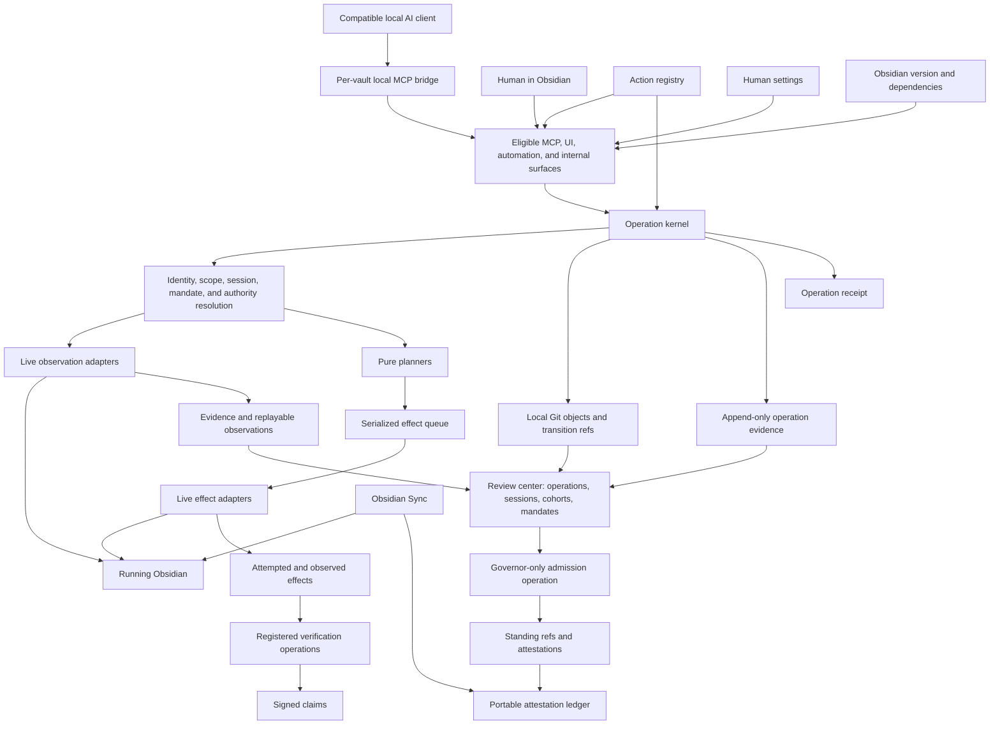

# Architecture

Governor is a suite of Obsidian plugins — a local bridge and operation kernel, a Git-backed history engine, an attestation verifier, and a human review surface — divided across two artifacts plus a set of capability satellites. Its architecture is organized around one principle: **every surface invokes a registered action through the same operation, authority, and observability boundary before it reads the vault, attempts an effect, or changes standing**.

This document describes the target-state architecture while preserving mechanisms already evidenced in the repository, such as live-app access, a local socket, write queue, journal, revisions, idempotency, stable addressing, protected acceptance, modules, and an in-app review pane. Git-backed proposals, durable sessions, mandates, cohorts, signed attestations, and Sync reconciliation are target-state additions.

## Three artifacts, one boundary

The suite has three roles and three trust postures. The split of code across them is [the suite split design](suite-split-design.md); what follows is what each role owns and where the line between them runs.

**The host** — `packages/host`, Obsidian plugin id `vault-mcp` — is the honest standalone product. It owns the socket transport and the embedded bridge, the guard (read-only mode and the path allowlist), kernel v0 (write queue, journal, idempotency, advisory locks, the uid index, the record guard), the operation executor and action registry, observation capture and the blob store, the core `obsidian_*` tool surface, scheme and JD addressing, the conformance rail, the module host, the external-tool registry, and the governance seam itself. Installed alone it gives audited, journaled, allowlist-scoped vault access over MCP. That is not a degraded mode: with no provider registered, each seam consultation iterates an empty list, so the standalone host is the vacuous case rather than a special one.

**The governance provider** — `packages/governor`, Obsidian plugin id `governor` — is the flagship consumer of the seam and the only thing in the suite that holds authority. Proposals, verification, admission, cohorts, mandates, transformations and promotion, the history store, the review pane, the gesture perimeter, and the legacy acceptance machinery with its migration, cutover and store-binding all live inside it, closure-held. It publishes five MCP tools back into the host through `vault-mcp-api` like any other publisher. Installing it turns audited access into governed access.

**Satellites** are capability packs — Bases, vocabulary, health, skills compilation, triage, cross-session coordination, fileclass, provenance, JD scaffolding, QuickAdd compilation — each its own plugin publishing tools through `vault-mcp-api`, with no special standing and no seam registration.

**The seam is the boundary, and it is deliberately narrow.** It offers exactly two hook classes and there will not be a third. A write observer runs after the host's own journal record, observe-only, dispatched off the caller's result path so a slow or throwing observer costs no one a write that already landed. A session refusal runs inside the kernel's queued closure at dequeue, bounded by the same write timeout as the operation itself, and is refusal-shaped rather than boolean: it returns a typed refusal or silence, so the type cannot express permission and no registrant can un-refuse what the host or another registrant refused. Registration is reachable from `app`, which is harmless; the registered closures are held in module-private WeakMaps, which is not optional, because a reachable observer is the thing that manufactures proposals. Every `register*` call returns a disposer and the disposer is the only revocation — `id` is a diagnostic label, never an address.

Two costs of the split are named rather than glossed. The provider is now removable like any plugin, where before it was inseparable from the host; the host answers that only by refusing to toggle or uninstall a registered provider's id, which stops an agent doing cleanup, not a determined human. And the provider's five tools became external tools, so their read-only claims are distrusted unless the operator lists `governor` in the host's trusted-read-only list, and under an active path allowlist the host refuses outright any of them that carries no recognized path key — four of the five. Both are stricter postures than the folded arrangement had, and the second costs availability to buy them.

## System components

## Settled implementation profile

The target uses these fixed boundaries:

- actions are stable postcondition contracts; tools and UI controls are surfaces, not execution owners;
- every invocation is an operation, with selective durability rather than mandatory logging of every read;
- substantive governed reads produce replayable observations; ephemeral observations cannot support proposals, verification, or admission;
- Governor guarantees replay only for information and effects crossing its own boundary, not model reasoning or external tool context;
- the operation registry and executor are introduced before the new governance stack, while existing tools migrate through a conservative compatibility adapter;
- sessions are replica-local and may be linked, not transferred;
- automatic mandated admission is limited to fully verified encoding, presentation, named representation, and tightly bounded structural transformations;
- portable standing begins prospectively; legacy acceptance imports as evidence, never fabricated signed authority;
- canonical proposal and cohort manifests—not Git commit metadata—are signed subjects;
- unadmitted proposals remain visible in Obsidian's working tree while standing remains separate;
- one vault-root worktree uses a stable human-chosen history scope distinct from every connection scope;
- local-human-observed, Governor-originated, Sync-attributed, and external/unattributed changes remain distinct;
- the portable ledger is an immutable envelope set with one-writer replica partitions and no destructive version-1 compaction;
- per-device signing keys support portable claim validation but do not encrypt the vault; and
- the first delivery sequence is local individual/cohort authority, then bounded mandates, then portable standing and Community release.

The settled decision record is [Governor design decision register](design-decision-register.md). The owning sections below remain normative; the register records why these choices were fixed.

## Live-app canonicality

Governor serves the vault open in the running Obsidian application. It uses Obsidian's metadata, link resolution, file manager, workspace, plugin registry, view engines, and supported APIs rather than maintaining a separate authoritative interpretation.

This matters because:

- a path is not a stable identity;
- link-aware moves belong to Obsidian's file manager;
- parsed properties should match what Obsidian honors;
- Bases results should come from the Bases engine rather than a reimplementation;
- active-note and workspace state exist only in the app; and
- host plugin availability is runtime state.

Headless pure cores are still preferred for deterministic planning and validation. The live adapter owns the irreducibly Obsidian-specific step.

## Local bridge

The bridge belongs to the host plugin and translates a local MCP connection into its in-process capability surface. In the target public configuration:

- it uses a per-vault local socket;
- the socket is owner-readable/writable only;
- no public network listener is enabled;
- each connection gets a Governor-issued identity binding plus a descriptive client claim;
- compact code mode and full schema mode share the same underlying registry; and
- disabling the bridge leaves the human review surface available.

The bridge is transport, not policy. It cannot register a capability around the guard.

The client may supply intent and a human-readable label. Governor assigns the authoritative connection, actor, and session binding. Git author strings and agent-provided names are not authentication.

## Connection-specific surface

The runtime surface is computed from:

- action definitions and capability projection entries;
- distribution profile;
- current posture;
- path scope;
- module settings;
- Obsidian version and feature detection;
- installed and enabled host plugins;
- trust declarations for external capabilities;
- active session and mandate;
- allowed change classes and budgets; and
- verifier and admission policy.

The surface must answer why something is unavailable. Source presence alone does not make a capability served, enabled, compatible, scoped, or authorized.

## Action registry and capability projection

The [Action registry](action-registry.md) owns action identity, postcondition, observations, effects, scope, authority, verification, retention, receipt, recovery, and eligible surfaces. The capability projection combines registered actions with modules, distribution, settings, posture, and live dependencies into user-facing outcomes. Together they generate or validate:

- runtime registration;
- compact discovery metadata;
- settings directory;
- user capability documentation;
- README disclosures;
- error and receipt expectations;
- security test matrix; and
- submission review inventory.

See [Action registry](action-registry.md) and [Capability projection](capability-manifest.md).

## Operation kernel and shared interception boundary

Every built-in and third-party surface resolves through one action registry and operation executor. The order for a mutation is:

1. identify the action, version, surface, and distribution eligibility;
2. create the operation and derive actor/connection binding;
3. validate and normalize arguments;
4. resolve stable or scheme addresses;
5. compute the effective scope and filter before reading;
6. capture required observations and their source state;
7. plan and freeze the intended effects;
8. enforce posture, session, mandate, change class, authority, and budget;
9. apply protected-property and opaque-operation policy;
10. enter the queue when effects may be attempted;
11. probe record status, revision, advisory overlaps, and idempotency at execution time;
12. create or update the Git-backed proposal state;
13. run the live Obsidian effect adapter when permitted;
14. observe actual effects independently where the action contract requires it;
15. record durable operation evidence;
16. run registered postcondition and class-specific verification operations;
17. emit required attestations; and
18. produce the receipt and review update.

Read actions use the same resolution, scope, operation, and receipt boundary but do not queue. Their observations are ephemeral, evidence, or replayable according to [Observations and replay](observations-and-replay.md).

## Addressing and identity

Literal paths remain useful but are not identity. Governor maintains a stable-identifier index from Obsidian's metadata cache and updates it from app events. A stable reference resolves to one visible note or refuses as unresolved/ambiguous.

Configured scheme references, such as a Johnny Decimal address, use provider-defined grammars and capabilities. They resolve after the reserved stable-identity form and before scope checks. Scheme allocation may compute an open address but never claims that it is reserved.

The journal records both resolved path and stable identity when available.

## Read-boundary containment

Scope is a vault-relative prefix set. Enforcement applies to direct arguments and to discovery:

- filter before reading;
- hide paths and counts outside scope;
- make hidden stable identities unresolved;
- scope backlinks, tags, history, pending review, and health reports;
- refuse whole-vault engines whose output cannot be bounded honestly; and
- disclose only documented low-bandwidth oracles inherent in Obsidian resolution.

Scope limits Governor-mediated access. It is not an operating-system sandbox.

## Write kernel

### Git object store

Governor records content and tree state in a standard local Git object database kept outside Obsidian Sync's ordinary file set. Proposal, session, and standing refs provide atomic local transitions, exact diffs, revision chains, selective admission, merge support, recovery, bundles, and interoperability.

Git is the history engine, not the authority model. A commit's author string does not establish actor identity, verification, acceptance, or standing. Signed Governor attestations bind those claims to exact subject digests.

### Queue

One FIFO queue per plugin instance runs one mutation at a time. Reads remain concurrent. A wall-clock deadline is re-evaluated on queue activity so background timer suspension cannot wedge the queue indefinitely.

### Revisions

The read path returns a revision token. A mutation carrying `if_rev` compares it at the front of the queue, after preceding writes have settled. A mismatch refuses before the handler.

### Idempotency

In-memory bounded keys collapse identical completed or in-flight retries. Identity includes operation, arguments, and revision. Reload clears the store. Abandoned timeouts do not become safely replayable.

### Advisory claims

Claims disclose overlapping work and expire by TTL. They do not lock or refuse writes. Scope bounds what a connection can claim and see. Claim changes are journaled as operational mutations.

### Operation evidence and journal

Monthly append-only JSONL records contain reduced operation metadata, not note bodies. Replayable observation payloads live in separate content-addressed local storage and are linked by digest. Late settlement appends a correction rather than editing history. Journal failure degrades observability but does not falsify the vault result; unavailable required replay storage blocks evidence-dependent work.

### Sessions and mandates

A durable session binds the Governor-derived actor, purpose, base state, scope, mandate, proposals, cohorts, receipts, expiry, and closure. A human-accepted mandate names allowed change classes, transformation, limits, verifier, admission mode, and recovery. An agent may counter-propose a mandate but cannot activate, widen, or renew it.

Ownership of the session is split across the seam, because a session is transport state and only the host knows a connection began. The host mints sessions, keeps their lifecycle log (`opened`, `closed`, `expired`) beside its own state, and applies a pure expiry floor that needs no store and no provider. The provider keeps refusal state only — revocation, and the session-to-mandate attachment — and answers the seam's refusal hook from it, so a human revoking a session in the review pane reaches the write path as a refusal at dequeue. No connection-lifecycle notification was added to the seam, which has a consequence worth stating plainly rather than hiding: the provider no longer witnesses a session opening, so revoking or attaching a mandate acts on a session id with no prior open record required. That is a real loosening. It is safe in this direction because revocation can only add refusals, and because mandate fit already binds by session id rather than by the session record.

### Cohorts

A cohort is an immutable manifest of exact proposal items selected by session, collection, scope, class, or their intersection. Its digest freezes the decision subject. A collection query remains dynamic; a cohort never does.

### Attestations and standing

Proposal, mandate, verification, admission, revocation, and effect claims are separate signed attestations. Governor admission requires an exact subject match, trusted verifier predicates, and either a direct human gesture or valid mandate. The authoring agent has no admission primitive.

## Content and structural actions

Reusable registered actions own semantics:

- note compose and write;
- pure end append;
- bounded section patch;
- supported frontmatter mutation;
- link-aware move;
- recoverable trash;
- plan-then-apply scheme mutation; and
- reported-effects scan operations.

Dedicated actions are preferred to generic commands because their postconditions, observations, effects, scope, preview, verification, retention, and recovery can be stated and tested.

## Acceptance and protected properties

The accepted family is a structural floor enforced at the shared write primitive and at every exceptional transport that can write content. The guard decides over the content Obsidian will honor, including frontmatter boundary variations.

That floor is host-side, and the split deliberately left it there: a host with no provider installed still refuses an agent stamping the accepted family into frontmatter, which is defense in depth rather than duplication. The fuller transition rules and everything downstream of them belong to the provider.

Human acceptance lives in an in-app review component with no agent accept or admit verb. It may cover an individual proposal, an immutable cohort, or a prospective mandate. Governor verifies the subject and authority conditions, emits an admission attestation, then atomically advances the local standing ref. A race that changes any subject aborts advancement.

Declared protected properties extend the same transition predicates. Authority-conferring values are honored from blessed baseline state, not raw unreviewed frontmatter.

## Review center

The review component ships in the governance provider plugin (`governor`), not in the host. It owns:

- operation timelines and observation/effect playback;
- baseline snapshots;
- pending-diff reconciliation;
- human attribution;
- sessions, mandates, proposals, cohorts, and revision sections;
- change-class grouping and consequence overlays;
- budgets, sampling, and expiry;
- human accept, mandate, request-changes, revert, defer, revoke, and supersede gestures;
- verification, admission, and revocation history; and
- a read-only pending index for agent coordination.

It does not publish accept-capable MCP tools.

## Obsidian Sync and replicas

Obsidian Sync carries visible vault files at file granularity. Governor's Git object database remains local. Optional portable-standing mode carries immutable attestations through synced community-plugin data.

A receiving replica imports file arrivals as external changes, validates signatures and subject digests, waits for every cohort item, and advances its local standing ref only when the exact cohort is complete. Partial arrival is **receiving**, not partial admission. A Sync merge or conflict changes the subject and invalidates prior verification for the changed result.

See [Git, Sync, and portability](git-and-sync.md).

## Modules

A module declares identity, user outcome, dependencies, settings, action references, surface bindings, posture, public eligibility, and health. Every binding resolves through the operation executor. Mutating optional modules cannot receive a raw accept, admit, signer, mandate-activation, baseline, or standing-ref primitive.

One bad module is skipped and reported rather than taking down the core surface. A load-bearing dependency failure is unavailable, not silently empty.

The [Module directory](modules.md) accounts for scheme and the conformance, survey, QuickAdd, identity/link, write-kernel, and external-publisher surfaces. **Scheme is now the only capability module the host mounts itself.** Acceptance was the second until the S3c split, and it did not become a satellite: it left the module registry entirely with the governance provider, taking its enabled flag and its `config` block into the provider's own `data.json` and settings tab. That is the difference between a capability pack and the perimeter — a satellite publishes tools through a contract, while the provider registers on the seam and owns authority, so a module row was the wrong shape for it in both directions. Nine capabilities that were once modules here do ship as separate satellite plugins, each publishing through `vault-mcp-api`: skills compilation as `vaultmcp-skills` (see [skills.md](skills.md)), triage as `vaultmcp-triage` (see [triage.md](triage.md)), cross-session coordination as `vaultmcp-crosssession` (see [crosssession.md](crosssession.md)), then — at the S7 read-tier extraction — the vocabulary provider as `vaultmcp-vocab` (see [vocabulary-module.md](vocabulary-module.md)), the health scan as `vaultmcp-health` and the Bases surface as `vaultmcp-bases` (see [bases.md](bases.md)), and finally the mutating tier: the fileclass CLI proxy as `vaultmcp-fileclass`, derived-content provenance as `vaultmcp-provenance` (see [provenance.md](provenance.md)), and JD scaffolding as `vaultmcp-jd-scaffold`.

## Public and private distributions

The Community profile includes bounded reads, scoped writes, preview-first structure, review, and deterministic report modules. Opaque or high-authority capabilities are absent.

Private packs are separate installable or locally configured units with their own manifest entries, threat additions, enablement, audit, recovery, and decommissioning. They cannot weaken human acceptance or Governor-only admission.

## Operational state ownership

| State | Owner |
|---|---|
| Capability projections, distribution, risk, and dependencies | Capability projection |
| Action contracts, observations, effects, surfaces, and execution policy | Action registry |
| Setting values and defaults | Settings schema |
| Stable error identifiers | Error registry |
| Operation and mutation reporting | Receipt schema |
| Served/optional/private/excluded status | Status and compatibility record |
| Human review projections and legacy baselines | Review center index and migration record |
| Operation event history | Operation journal and observation/effect stores |
| Content history and proposal transitions | Local Git object store and refs |
| Sessions, mandates, cohorts, and signed claims | Attestation ledger |
| Admitted standing | Governor standing refs and admission attestations |
| Deprecation and authority cutover | Migration register |

No summary document becomes a second owner.

## Failure policy

Controls fail closed when they protect authority, path scope, explicit preconditions, or inspectability. Advisory protections may degrade with a visible warning when failure-closed would create a vault-wide outage. Each decision is declared in the action registry, generated capability projection, and [Threat model](threat-model.md).

## Extension rule

A new capability is architecturally complete only when it has:

- one or more registered action definitions and eligible surface bindings;
- a generated capability projection;
- a bounded user outcome;
- live availability detection;
- exact scope behavior;
- risk and posture;
- preview or an explicit reason it is private/excluded;
- shared operation-executor registration;
- postcondition verification;
- observation capture, dependency, replay, and retention behavior;
- intended, attempted, reported, and observed effect behavior;
- receipt and errors;
- security and degraded-mode tests;
- documentation owner;
- migration/deprecation consequences;
- change class, verifier predicate, and cohort eligibility;
- session and mandate behavior;
- Git and attestation projection; and
- Sync/replica behavior.

“The handler works” is only one step.
