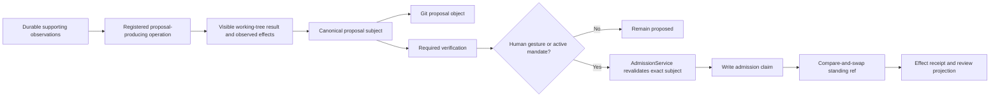

# Governor coding-agent development guide

Status: normative implementation handoff for the settled target design  
Decision date: 2026-08-20  
Repository: `nelsonlove/obsidian-governor`

> [!important] Gate 1 is COMPLETE (2026-08-22, released as 0.17.0)
> Work packages WP0–WP8 — the action registry, executor, observation/effect substrate, canonical subjects, history store, sessions, proposals, verification, individual and cohort admission, and the legacy import + cutover — are MERGED, shipped, and live (the authority cutover ran 2026-08-23). Do not re-implement them; [Status and compatibility](status-and-compatibility.md#current-release-state) owns what is shipped. This guide remains the normative process and work-package spec for Gates 2+ (WP9 onward), and its §8–§15 disciplines (canonical subjects, the admission door, test families) bind all future work.

> [!important]
> This guide tells coding agents how to implement the settled Governor design in the existing repository. It is not permission to reinterpret the authority model. When current code conflicts with the target contract, preserve working behavior long enough to migrate it safely, then retire the predecessor explicitly.

## 1. Read this first

(Repository-baseline sections below describe the repo as of the 2026-08-20 decision date — a dated snapshot, kept for the record; the Gate 1 work has since merged.)

Before changing code, read these documents in order:

1. [Governor design decision register](design-decision-register.md)
2. [Architecture](architecture.md)
3. [Action registry](action-registry.md)
4. [Operation contract](operation-contract.md)
5. [Observations and replay](observations-and-replay.md)
6. [Review and safety](review-and-safety.md)
7. [Change classes](change-classes.md)
8. [Sessions, mandates, and cohorts](sessions-mandates-and-cohorts.md)
9. [Standing and attestations](standing-and-attestations.md)
10. [Git, Sync, and portability](git-and-sync.md)
11. [Capability projection](capability-manifest.md)
12. [Threat model](threat-model.md)
13. [Testing and release](testing-and-release.md)
14. [Migration and deprecation](migration-and-deprecation.md)

If this guide and a normative owner disagree, stop and report the contradiction. Do not choose the more convenient interpretation.

## 2. Goal and delivery strategy

**Goal:** establish one operation-centric execution architecture, then migrate the existing Governor acceptance machinery into subject-bound Git, verification, cohort, mandate, admission, and replica services without giving agents acceptance authority or breaking the live Obsidian workflow.

Implementation proceeds through one foundation gate and three usable delivery gates:

0. **Operation seam** — action registry, universal operation/observation/effect schemas, shared executor, conservative compatibility adapter, and bidirectional surface inventory. New work is native; current tools migrate incrementally.
1. **Local governed authority** — individual and immutable-cohort decisions over canonical subjects, with replayable governed reads, local Git history, origin classification, verification, receipts, admission, revocation, recovery, and legacy migration.
2. **Bounded delegation** — human-authored mandates over eligible actions, counter-proposals, budgets, expiry, and carefully promoted automatic admission.
3. **Portable standing and public release** — per-device signing, portable append-only authority evidence, replica reconciliation, exact public/private bundle separation, and Community release evidence.

Do not build all services independently and integrate them at the end. Each gate must contain at least one complete path from mutation through human-visible outcome and recovery.

## 3. Repository baseline

The repository is a TypeScript ESM monorepo:

| Path | Current responsibility | Target treatment |
|---|---|---|
| `packages/host/` | Community Vault MCP host plugin (id `vault-mcp`): bridge, MCP tools, live Obsidian adapters, modules | Primary implementation target |
| `packages/governor/` | Community governance provider plugin (id `governor`): governance UI, proposals, admission, mandates | Primary implementation target |
| `packages/core/` | Shared guards, backend contracts, responses, tool registry | Keep narrowly shared; do not move plugin-only authority code here prematurely |
| `packages/vault-mcp-api/` | External publisher SDK | Preserve compatibility; extend only through registered actions and the operation executor |
| `packages/server/` | Separate remote/filesystem server | Not part of Gate 1 or the Community authority claim |
| `docs/` | Current implementation and historical design docs | Replace or reconcile through the documentation migration, never silently |

Snapshot observed on 2026-08-20:

- local `main` was four commits behind the locally known `origin/main`;
- the primary checkout had a user-owned `README.md` modification and an untracked `.claude/` directory;
- the plugin package contained 143 test files;
- current acceptance used per-path baseline blobs, an acceptance JSONL log, a pending queue derived from the write journal, gesture-gated human acceptance, and class/per-note auto-accept; and
- `governor/wiring/wiring.ts` and `governor/wiring/pane.ts` were large integration surfaces carrying load-bearing reachability controls.

Never use that dirty primary checkout for implementation. Every coding task begins in a fresh worktree from the current reviewed upstream branch. Preserve the user's working tree exactly.

## 4. Fixed authority rules

These are test invariants, not design suggestions:

1. Governor is the only component that admits or advances standing.
2. An agent may propose work, accept a delegation, refuse it, or counter-propose narrower bounds.
3. An agent cannot accept a result, activate or widen a mandate, choose an authoritative actor or signer, sign as the human, admit, revoke human authority, or advance a standing ref.
4. Human acceptance may cover one proposal, one immutable cohort, or one prospective bounded mandate.
5. A session is replica-local. Another replica creates a linked session rather than inheriting its live capability.
6. A collection, folder, session query, or filter may select a cohort; the decision covers only the frozen canonical cohort manifest.
7. Standing predicates cover every exact item. Sampling may supplement an audit but never establishes standing.
8. Git records content and transitions. Git author, committer, branch, and tag labels do not establish identity or authority.
9. Current working-tree bytes may be unadmitted. Standing-aware consumers use Governor's resolver.
10. Obsidian Sync transports files. Arrival, file metadata, and conflict labels do not establish authority.
11. Private signing keys never enter notes, Git, journals, ordinary settings, release artifacts, or Sync.
12. Governor signs claims; it does not encrypt the vault.
13. Legacy acceptance imports as labeled evidence. It does not receive fabricated signatures or portable standing.
14. A missing, conflicted, or unverifiable dependency fails closed when it protects scope, authority, or admission.
15. Every invocation is an operation of one registered action; MCP calls, UI controls, automations, and internal calls are surfaces rather than semantic owners.
16. Observation durability is independent of invocation: low-information plumbing may be ephemeral, but substantive governed-session reads are replayable by default.
17. An ephemeral observation cannot support a proposal, verification, or admission. Governor re-observes durably rather than silently promoting it.
18. Playback stops at Governor's boundary. It covers registered inputs, Governor-returned observations, effects, receipts, and authority evidence—not model reasoning or external client context.

## 5. Change classes

Use exactly these six classes:

| Class | Meaning | Example | Default admission posture |
|---|---|---|---|
| Encoding | Byte/carrier normalization without information or display change | Equivalent line endings or serialization | Automatic only under a named, fully verified mandate |
| Presentation | Display or layout change without information change | Whitespace or wrapping | Automatic only under a named, fully verified mandate |
| Representation | Same information in a different structured carrier | Move a prose property into `## Description` | Automatic only for a named transformation with full source/destination verification |
| Structural | Filesystem location or containment change without semantic or authority change | Verified link-aware move | Automatic only when identity, link, scope, collision, and recovery predicates all pass |
| Content | Meaning is added, removed, or changed | Rewrite a description | Human individual or coherent cohort decision |
| Authority | Standing, mandate, trust, admission, revocation, or protected policy changes | Activate a mandate | Direct human authority path only |

Scale and consequence are separate fields. One content word may be more consequential than 10,000 encoding repairs.

## 6. Current-to-target migration map

| Current implementation | Target owner | Migration rule |
|---|---|---|
| `packages/host/src/kernel/journal.ts` operation records | Universal operation evidence | Preserve current records as the first compatibility evidence; version and extend rather than inventing a parallel journal |
| `Kernel.runMutation` | Shared operation executor | Route through the executor adapter first; keep mutation queue semantics while reads, plans, verification, and authority actions adopt the same lifecycle |
| `packages/host/src/mcp/guarded.ts` and other surface registration | Action registry plus surface bindings | Inventory both directions, bind every surface to a versioned action, and make raw handler reachability a build failure |
| Current read handlers | Observation contracts and store | Apply scope/redaction before capture; do not claim replayability until the native action and payload tests exist |
| Current mutation handlers | Effect contracts | Preserve existing guard/queue behavior through the adapter; add intended, attempted, and observed effects incrementally |
| `governor/kernel/baseline-store.ts` | Git history plus standing resolver | Retain as a read-only legacy-import adapter during cutover; stop direct baseline advancement after cutover |
| `governor/kernel/hash.ts` FNV hash | Canonical SHA-256 subject digests | FNV may remain only as a non-authoritative cache/diff optimization |
| `governor/kernel/accept.ts` | Human gesture plus admission service | Preserve closure-only reachability; replace direct `setBaseline` with an exact admission request |
| `governor/kernel/queue.ts` | Proposal/review projection | Project from proposal, standing, origin, and journal state rather than journal-plus-path baseline alone |
| `governor/kernel/classify.ts` | Origin classifier | Keep positive trusted-human-input evidence; emit an origin classification rather than silently deciding authority inside the classifier |
| `governor/kernel/auto-accept/*` | Transformation registry, verifiers, and mandate policy | Reassess every class; no legacy entry receives automatic authority merely because it was previously allowlisted |
| `auto-accept: all` | No target equivalent | Disable and migrate; it is incompatible with bounded class-based admission |
| `auto-accept: appends` | Content proposal policy | Appended prose is content and returns for human decision |
| `governance/acceptance-log.jsonl` | Historical import plus structured claims | Preserve as evidence; new proposal/verification/admission/revocation/effect claims use versioned records |
| `governance/pending-index.json` | Rebuildable review projection | Never authority; absence remains unavailable rather than empty |
| `governor/wiring/wiring.ts` | Live event adapters and controller composition | Split only along work being changed; preserve module-scope accept reachability |
| `governor/wiring/pane.ts` | Review-center views | Add individual/cohort/mandate projections behind a narrow controller; no accept callable on reachable instances |
| `main.ts` static imports | Distribution composition root | Public build imports only public/core and approved optional modules; private code is absent from the bundle |
| `kernel/modules/manifest.ts` | Module packaging plus generated capability projection | Reference registered actions; do not make module presence equivalent to public eligibility or action semantics |

The legacy system remains the sole authority until the new Gate 1 path passes its cutover checks. After cutover, legacy writers become read-only or retired. Never run two standing writers concurrently.

## 7. Target package map

Follow the repository's existing split: pure, Obsidian-free policy under `src/kernel/`; live application wiring under `src/`; MCP adapters under `src/mcp/`; host tests under `packages/host/tests/`, governance provider tests under `packages/governor/tests/`.

### Action, operation, observation, and effect substrate

Create before new governance feature services:

```text
packages/host/src/kernel/operations/
  action.ts             action ids, versions, semantic contract references
  operation.ts          universal invocation envelope and lifecycle states
  registry.ts           canonical action registry and bidirectional validation
  executor.ts           shared policy/capture/plan/effect/evidence/receipt orchestration
  surface-binding.ts    MCP, UI, automation, module, external, and internal bindings
  compatibility.ts      conservative adapter for current handlers

packages/host/src/kernel/observations/
  observation.ts        ephemeral, evidence, and replayable manifests
  capture-policy.ts     action/session defaults, redaction, freshness, and retention
  dependencies.ts       durable-dependency and sufficiency validation
  store.ts              content-addressed payload interface

packages/host/src/kernel/effects/
  effect.ts             intended, attempted, and observed effect contracts
  settlement.ts         late, partial, uncertain, and correction semantics

packages/host/src/kernel/observations/
  local-store.ts        protected replica-local replay payload adapter (HOST-side)
  retention.ts          audited expiry, export, dependency check, and deletion
```

The observation store is **host** machinery, not governance. It was filed under `governor/wiring/` until the suite split's S3b, when condition 9's ruling (2026-08-27) moved it: it had one consumer — the host's own transport — and already imported the host's observation store and paths, so its position under `governor/` was a filing error rather than a design. The provider reasons about observation REFERENCES (`{id, digest, capture}`) in `governor/kernel/contracts/subject-v1.ts` and never touches the store. `retention.ts` does not exist yet; it is target state, and it belongs beside `local-store.ts` on the host side when it is built.

The executor is not a second mutation kernel. It becomes the seam around the existing `Kernel.runMutation` and guarded MCP path, then absorbs their responsibilities as native actions migrate. Compatibility bindings make only claims the current implementation proves: no invented replayability, observed effects, mandate eligibility, or verified admission.

### Pure governance contracts

Create:

```text
packages/governor/src/kernel/contracts/
  change-class.ts       six-class registry and escalation rules
  ids.ts                branded ids for vault, replica, session, mandate, proposal, cohort, key, predicate
  origin.ts             four origin classes and confidence
  states.ts             development, verification, authority, record, operational axes
  subject-v1.ts         proposal-item and cohort schemas

packages/core/src/          (published contracts — moved out of the provider at the suite split's S3a)
  canonical-json.ts     version-1 canonical serialization
  digest.ts             SHA-256 digests over exact UTF-8 bytes
  uuidv7.ts             id minting, shared because both halves mint
  session.ts            the SessionV1 contract (the HOST mints; condition 7)
  dispositions.ts       the generic disposition-descriptor substrate
```

Keep exact note-content digests byte-preserving. Do not normalize the note before hashing it. Version-1 structured manifests use RFC 8785 JSON canonicalization, contain no floating-point fields, encode integer counts as non-negative safe integers, and use explicit `null` where the schema requires an absence marker. Schema strings are validated before serialization; canonicalization does not reinterpret note content.

### Local history

Create:

```text
packages/governor/src/kernel/history-store/
  types.ts              repository-neutral object/ref contracts
  history-scope.ts      stable human-chosen include/exclude policy
  refs.ts               internal ref names behind one service
  repository.ts         interface used by proposal and admission services
  (recovery.ts          BUILT, NEVER CALLED, DELETED — see below)

packages/governor/src/wiring/history-store/
  git-repository.ts     live standard-Git implementation
  local-data-root.ts    platform-appropriate outside-vault storage
```

The Community adapter must not require the user to install Git or expose a generic shell command. Select a pure-JavaScript Git implementation through a bounded dependency spike proving blob, tree, commit, ref compare-and-swap, merge inspection, and export behavior. If no candidate satisfies those tests and bundle policy, stop the gate rather than silently falling back to a proprietary store. A system-Git adapter may exist only as a separate operator implementation behind the same interface.

### Sessions, proposals, verification, cohorts, and admission

Create:

```text
packages/governor/src/kernel/sessions/
  session.ts
  session-store.ts

packages/governor/src/kernel/proposals/
  proposal.ts
  proposal-store.ts
  proposal-builder.ts

packages/governor/src/kernel/verification/
  predicate.ts
  registry.ts
  verify.ts

packages/governor/src/kernel/cohorts/
  cohort.ts
  freeze.ts
  coverage.ts

packages/governor/src/kernel/admission/
  policy.ts
  service.ts
  settlement.ts
  (standing-resolver.ts BUILT, NEVER CALLED, DELETED — see below)

> [!warning] Two entries in the listings above were BUILT AND THEN DELETED (#379, 2026-08-31)
> `recovery.ts` (`planRecovery`) and `standing-resolver.ts` (`createStandingResolver`), plus `decideSettlement` in `settlement.ts`, were all written to spec, fully unit-tested, and **never called from `src/`**. Between them they classified the admission crash windows and planned the repair, so they read as a working recovery system — and `admission/service.ts` said one existed. None of it ran.
>
> Nelson's ruling was to delete rather than wire. The consequence is recorded honestly in `admission/service.ts`'s header: the window between the standing-ref advance and the settlement append is real and **unrepaired**. What still holds is that no ref ever points at evidence that does not exist, because the claim lands before the ref moves.
>
> These lines are left in the listings rather than removed because this document is a decision record: a coding agent that builds `recovery.ts` from this spec would be rebuilding something already deliberately removed. If the crash window is later judged to matter, wire it — do not re-derive it, the implementation is in git history.

packages/governor/src/kernel/origins/
  classifier.ts
  reconcile.ts
```

### Gate 2 mandates

Create only after Gate 1 is complete:

```text
packages/governor/src/kernel/mandates/
  mandate.ts
  draft.ts
  policy.ts
  budgets.ts
  lifecycle.ts
```

### Gate 3 signing and replicas

Create only after the local authority path is proven:

```text
packages/governor/src/kernel/attestations/
  statement.ts
  dsse.ts
  trust.ts
  ledger.ts

packages/governor/src/wiring/attestations/
  signer.ts
  secret-store.ts
  portable-ledger-adapter.ts

packages/governor/src/kernel/replicas/
  reconciler.ts
  completeness.ts
  conflicts.ts
```

Use platform cryptography; never implement signature primitives. Version 1 uses Ed25519 and DSSE pre-authentication encoding when the supported Electron/Node runtime passes compatibility fixtures. Private material is encrypted at rest through an available operating-system protected facility. If protected secret storage is unavailable, portable signing is unavailable; plaintext fallback is forbidden.

### Capability projection and distribution ownership

Create:

```text
packages/host/src/kernel/capabilities/
  types.ts
  projection.ts
  validate.ts
  projections.ts

packages/host/src/distribution/
  public-modules.ts
  operator-modules.ts
```

The action registry owns execution semantics. Capability code projects eligible registered actions into client/user outcomes and cannot override observation, effect, authority, verification, receipt, or recovery contracts.

`public-modules.ts` is the only module composition imported by the Community entry point. `operator-modules.ts` is not reachable from that graph. A bundle-inspection test proves that private module identifiers and implementation markers are absent from `main.js`.

## 8. Canonical version-1 subjects

Use these logical fields. TypeScript names may follow repository style, but their serialized names and meanings are stable.

```ts
type Sha256Digest = {
  algorithm: "sha256";
  value: string; // 64 lowercase hexadecimal characters
};

type ProposalItemSubjectV1 = {
  schema: "governor.proposal-item/v1";
  vaultId: string;
  noteId: string;
  path: string | null;
  pathSemanticallyRelevant: boolean;
  base: Sha256Digest | null;
  proposed: Sha256Digest;
  attachments: Array<{ id: string; digest: Sha256Digest }>;
  sideEffects: Array<{ kind: string; target: string; digest: Sha256Digest | null }>;
  changeClasses: Array<"encoding" | "presentation" | "representation" | "structural" | "content" | "authority">;
  transformation: { id: string; version: string };
  predicates: Array<{ id: string; version: string }>;
  producingOperation: { id: string; action: string; actionVersion: number };
  observations: Array<{ id: string; digest: Sha256Digest; capture: "evidence" | "replayable" }>;
  sessionId: string;
  mandateId: string | null;
};

type CohortSubjectV1 = {
  schema: "governor.cohort/v1";
  items: ProposalItemSubjectV1[];
  resolvedScope: { include: string[]; exclude: string[] };
  excludedProposalIds: string[];
  recoveryUnit: "item" | "cohort";
};
```

Rules:

- sort cohort items by `noteId`, then proposed digest, then path with `null` before strings;
- sort attachments by id and side effects by kind, target, then digest;
- sort classes in the canonical six-class order;
- sort predicates by id then version;
- sort observations by id then digest and reject `ephemeral` in a proposal subject;
- reject duplicate item identities rather than silently deduplicating;
- hash exact note bytes separately before inserting their digest into the manifest;
- use UUIDv7 for newly minted session, mandate, proposal, cohort, replica, and key-registration record ids; stable note ids remain governed by the vault's existing identity contract; never derive identity from path or Git author; and
- commit canonical fixtures before any service consumes the schemas.

Any incompatible change creates `/v2`. Do not change `/v1` serialization in place.

## 9. The only admission path



`AdmissionService` is the only code allowed to advance standing. It receives a subject digest and authority reference, re-reads current state, resolves every required predicate, and performs compare-and-swap against the expected standing ref.

The admission call is itself a Governor-only registered authority operation. It has no agent-facing surface binding. It validates that every proposal and verification dependency is evidence or replayable, never ephemeral.

It does not accept:

- actor or signer names from the caller;
- arbitrary Git ref names;
- a mutable selector in place of a cohort digest;
- caller-supplied verifier success;
- sampling as full coverage;
- an expired or revoked mandate;
- a class inferred only from agent intent; or
- a result with partial, uncertain, receiving, or conflicted state.

A source-scan test fails if production code outside the history-store implementation and admission service can advance a standing ref. The history-store service itself accepts a capability token or closure available only to `AdmissionService`; a public TypeScript method with a suggestive name is not sufficient isolation.

## 10. Settlement and crash recovery

Every proposal/admission transition records a durable settlement phase:

| Phase | Durable fact | Recovery behavior |
|---|---|---|
| Observed | Supporting observation manifests and replay payload references where required | Refuse dependent work if evidence is absent, corrupt, stale for the predicate, or ephemeral |
| Planned | Arguments, base digest, scope, class, expected effects | Revalidate or expire; no effect claimed |
| Attempted | Live adapter may have changed the working tree | Re-observe before retry; outcome may be uncertain |
| Effects observed | Independent post-operation observation records actual state | Use actual effects for proposal and recovery; never infer them from handler success |
| Recorded | Exact result exists in local Git history | Rebuild proposal projection |
| Verified | Versioned predicates cover the exact subject | Invalidate on any subject or predicate-version change |
| Authorized | Direct gesture or valid mandate covers the subject | Revalidate expiry, revocation, scope, and budgets |
| Admitted | Admission claim exists and standing ref points to the subject | Treat as standing even if effect receipt is missing; rebuild receipt |
| Effect recorded | Local replica realization was observed | Reconcile display/indexes; never manufacture authority |

Required ordering for admission:

1. revalidate subject and authority;
2. construct and durably store the admission claim;
3. compare-and-swap the standing ref from its expected predecessor;
4. append the effect/settlement record; and
5. refresh rebuildable projections.

An admission claim written without a ref advance is unattached evidence and can be retried safely. A ref that points to a missing or invalid claim is a critical health failure and must not be presented as standing. Recovery appends corrective evidence; it never rewrites historical claims.

## 11. Worktree and branch protocol

Every implementation package uses its own Git worktree.

1. Fetch the current remote state.
2. Confirm the primary checkout's dirty files and do not touch them.
3. Create a worktree from the current reviewed base.
4. Use one branch per work package.
5. Keep commits small and scoped to one logical contract.
6. Rebase or merge the latest integration branch before final verification.
7. Open a PR; do not push directly to `main`.
8. Run an independent fresh-context review.
9. Fix every high-confidence finding and rerun the complete package tests.
10. Merge only when the independent review is clean or all findings are resolved.

Suggested branch names:

```text
feat/governor-g0-action-registry
feat/governor-g0-operation-executor
feat/governor-g0-observations-effects
feat/governor-g1-subject-contracts
feat/governor-g1-history-store
feat/governor-g1-sessions-origins
feat/governor-g1-individual-admission
feat/governor-g1-cohorts
feat/governor-g1-legacy-cutover
feat/governor-g2-mandates
feat/governor-g3-signing
feat/governor-g3-replicas
feat/governor-g3-public-bundle
```

## 12. Work packages and dependencies

### WP0 — Action registry and complete surface inventory

**Decision coverage:** D07, D14, D15, D18  
**Primary files:** current guarded MCP registration, `Kernel.runMutation`, module manifests, UI/internal entry points, tool inventory, package scripts  
**Create:** operation action/registry/surface-binding files, capability projection files, registry fixtures, and bidirectional drift tests

Deliver:

- a canonical versioned action schema defined by vault-state postcondition;
- an inventory of every MCP, compact-code, UI, automation, module, external-publisher, and internal surface;
- an inverse inventory proving every reachable handler has a registered action and every binding resolves;
- exact `public-default`, `public-optional`, `private`, and `excluded` distribution as a generated capability projection;
- conservative compatibility declarations for all existing handlers; and
- no change to acceptance authority.

This is Gate 0's first merge. No later package adds a callable handler outside this registry.

### WP1 — Universal operation executor and compatibility seam

**Decision coverage:** D14, D15, D18  
**Create:** operation envelope, lifecycle, executor, compatibility adapter, receipt integration, and executor-reachability tests  
**Modify:** current guard and mutation kernel only through narrow integration points

Deliver:

- one lifecycle for read, plan, mutation, verification, and authority operations;
- Governor-derived operation id, actor/session binding, action/version, surface, inputs, dependencies, state, and receipt;
- all current surface calls routed through the executor and compatibility binding before the existing handler;
- preservation of current scope, queue, revision, idempotency, protected-property, timeout, and journal behavior;
- conservative claims for compatibility actions; and
- source/runtime tests that reject raw handler reachability.

The executor initially wraps the existing `Kernel.runMutation`; it does not duplicate or bypass it. Native migration later moves responsibilities behind the operation contract one action at a time.

### WP2 — Observation, effect, and replay substrate

**Decision coverage:** D15, D16, D17, D18  
**Create:** observation/effect packages, protected local replay store, retention/export/deletion controls, and capture/playback tests  
**Modify:** executor phases, privacy/settings projections, first read and mutation vertical slices

Deliver:

- ephemeral, evidence, and replayable observation schemas;
- replayable-by-default substantive reads in governed sessions and evidence default for ordinary durable reads;
- scope filtering, redaction, and truncation before capture;
- content-addressed payload integrity and playback without re-reading current vault state;
- current-authorization checks for playback;
- durable dependency refusal for ephemeral observations;
- intended, attempted, and observed effects plus late/partial/uncertain correction semantics;
- explicit Governor-boundary wording and external-trace labeling; and
- one native replayable read followed by one native proposal-producing mutation.

Gate 0 is complete only when WP0–WP2 merge and the compatibility path cannot overstate replayability, observed effects, mandate eligibility, or verified admission.

### WP3 — Canonical subjects and fixtures

**Decision coverage:** D08, D13  
**Create:** contracts files listed in sections 7–8 and `packages/governor/tests/governance-subject-v1.test.mjs`  
**Fixture:** `packages/governor/tests/fixtures/governance-subject-v1.json`

Deliver:

- exact byte digests;
- RFC 8785 canonical structured serialization;
- proposal/cohort subject builders;
- stable error identifiers for invalid, duplicate, noncanonical, and unsupported-version input;
- golden digests for ASCII, Unicode, null paths, attachments, structural paths, and reordered input; and
- a cross-runtime fixture that produces the same digest in Node and the Obsidian renderer.

No Git, session, verifier, attestation, or authority UI package starts until WP3 fixtures merge.

### WP4 — History scope and Git repository service

**Decision coverage:** D06, D08, D10, D11  
**Create:** history-store files and `packages/governor/tests/governance-history-store.test.mjs`  
**Modify:** `packages/host/src/paths.ts`, settings schema/UI, privacy/status projections

Deliver:

- one vault identity and vault-root worktree;
- a human-chosen history scope independent of connection allowlists;
- an outside-vault, outside-Sync Git directory;
- standard blobs, trees, commits, diffs, and internal refs behind `HistoryRepository`;
- compare-and-swap ref behavior;
- visible-working-tree proposal recording;
- move, missing, restore, tracked/untracked-boundary, and corrupt-object behavior; and
- export/read compatibility without exposing raw ref advancement.

The dependency spike is part of this PR's design evidence. The final PR includes the chosen dependency, license/bundle impact, and tests; it does not leave two Git adapters active.

### WP5 — Replica-local sessions and origin classification

**Decision coverage:** D01, D12  
**Create:** sessions/origins files and `governance-session.test.mjs`, `governance-origin.test.mjs`  
**Modify:** `governor/kernel/classify.ts`, journal actor schema, connection context, `governor/wiring/wiring.ts`

Deliver:

- durable session ids bound to vault, replica, connection actor, base state, scope, expiry, and optional mandate reference;
- durable grouping of operations, observation/effect references, proposals, verification, and receipts;
- `continuedFrom` and `relatedSession` without capability transfer;
- Governor-originated, local-human-observed, Sync-attributed, and external/unattributed origins;
- positive trusted editor-input behavior retained;
- ambiguous changes left stale/proposed rather than silently admitted;
- session expiry/revocation at dequeue and admission time; and
- actor fields ignored or refused when supplied by a client.

### WP6 — Individual proposal, verification, and admission

**Decision coverage:** D03, D06, D11, D13, D14 Gate 1  
**Create:** proposals, verification, and admission files plus `governance-individual-admission.test.mjs` and `governance-settlement.test.mjs`  
**Modify:** `governor/kernel/accept.ts`, `governor/wiring/wiring.ts`, current pending/history projections

Deliver one end-to-end path:

1. a native action consumes durable supporting observations and a guarded write lands visibly;
2. Governor records intended, attempted, and observed effects, then builds the canonical proposal;
3. a registered verifier covers the exact subject;
4. the human clicks the existing unreachable gesture-gated Accept surface;
5. `AdmissionService` revalidates and advances standing;
6. the UI and agent receipt distinguish operation, verification, acceptance, admission, and effect; and
7. revert creates new history and preserves the rejected result.

Keep the current closure-captured human control. Do not place `AdmissionService`, a ref capability, or an accept function on the plugin instance, view instance, Obsidian command registry, MCP registry, external API, or DOM property.

### WP7 — Immutable cohorts and full coverage

**Decision coverage:** D02, D03, D13, D14 Gate 1  
**Create:** cohort files plus `governance-cohort.test.mjs`, `governance-cohort-ui.test.mjs`, and a 600-note fixture generator  
**Modify:** review controller and pane through narrow projections

Deliver:

- selectors for session, collection/folder, scope, class, transformation, verifier result, and intersection;
- freeze into an exact immutable subject before decision;
- per-item and aggregate full-coverage verification;
- exclusions that create a new digest;
- one human gesture accepting the exact cohort;
- request-revision and split-by-finding behavior;
- item/cohort recovery as declared; and
- synthetic 600-note description-carrier representation test with deliberate exceptions.

The test must prove that later work cannot enter a frozen cohort and that one failed item cannot be silently dropped or admitted.

### WP8 — Legacy evidence import and authority cutover

**Decision coverage:** D04, D06, D14 Gate 1  
**Create:** `governor/kernel/migration/legacy-import.ts`, cutover state, tests, and migration report  
**Modify:** `baseline-store.ts`, acceptance log readers, settings migration, status and troubleshooting

Deliver:

- idempotent import of baseline blobs, accepted properties, acceptance log, pending index, and current proposal states;
- explicit `legacy-import` provenance with known timestamp/source;
- no fabricated signatures, predicates, admissions, or portable standing;
- local continuity for legacy accepted subjects until changed;
- selective re-acceptance into new standing;
- a single human-confirmed cutover that disables old baseline writers;
- rollback while the predecessor remains read-only; and
- a source/runtime test proving only one standing writer is active.

Remove or disable whole-vault “Adopt baseline” as an ordinary operating control after cutover. A migration bootstrap cannot remain a permanent mass-silence capability.

### Gate 1 evidence checkpoint

Before Gate 2:

- WP0–WP8 are merged;
- every invocation resolves through the operation executor and the registry/runtime/projection inventories agree;
- one replayable read reproduces the stored payload, and an ephemeral observation is refused as a proposal dependency;
- plugin typecheck and all workspace tests pass;
- one individual and one 600-item cohort path work in a synthetic vault;
- crash points between apply, Git record, verification, authority, admission, and effect have recovery tests;
- current local-human typing remains usable;
- legacy data imports without conferring portable authority; and
- old baseline/auto-accept writers are inactive after cutover.

### WP9 — Mandate drafting, negotiation, and lifecycle

**Decision coverage:** D02, D03, D14 Gate 2  
**Create:** mandate files and `governance-mandate.test.mjs`  
**Modify:** review-center mandate UI and session authorization

Deliver:

- agent-authored draft and counter-proposal;
- human gesture activation;
- immutable scope, classes, transformation, predicate versions, item/byte/time/failure budgets, expiry, and recovery;
- exact eligible action ids and versions plus required observation durability;
- amendment by replacement, never mutation;
- revoke, expire, exhaust, and stop conditions;
- separate `mayProduce` and `mayAdmit`; and
- replay refusal across delegate, session, scope, class, transformation, predicate, expiry, and revocation.

### WP10 — Transformation registry and promoted automatic admission

**Decision coverage:** D02, D03, D07, D14 Gate 2  
**Create:** named transformation registry, promotion evidence schema, tests  
**Modify:** legacy auto-accept registry and settings

Deliver:

- exact named transformations for eligible encoding, presentation, representation, and structural work;
- separately versioned deterministic verifiers;
- full coverage and exception quarantine;
- cohort-decision mode by default;
- promotion to automatic admission only after recorded live evidence for that exact transformation/verifier/recovery tuple;
- class escalation refusal; and
- no automatic content or authority admission.

Reassess `uid-stamp`, `timestamp`, `canonical-order`, and `link-heal` individually. Stable identity can be authority-sensitive; a previous “rail-neutral” label does not itself authorize the target class. Delete the `all` policy and migrate `appends` to content proposals.

### Gate 2 evidence checkpoint

Before Gate 3:

- the human can counter, activate, inspect, revoke, and expire a mandate;
- the 600-note representation transformation has pilot, cohort, recovery, and automatic-mode evidence;
- every exception remains proposed;
- content and authority automatic admission are impossible; and
- mandate replay and class escalation tests pass.

### WP11 — Local signing identity and attestation envelopes

**Decision coverage:** D03, D08, D09  
**Create:** attestation and signer files plus official-vector tests  
**Modify:** admission and verification claim storage

Deliver:

- separate proposal, mandate, verification, admission, revocation, and effect statements;
- producing operation and supporting observation digests where the predicate depends on observed state;
- in-toto statement shape in a DSSE envelope;
- Ed25519 signatures and key ids;
- one signing identity per device/verifier role;
- OS-protected private-key storage with explicit unavailability;
- human key registration, rotation, revocation, and optional encrypted recovery export; and
- no note bodies or private keys in portable envelopes.

A valid signature proves only key possession and statement integrity. UI and receipts must not call that truth, correctness, or human review.

### WP12 — Portable ledger and replica reconciliation

**Decision coverage:** D01, D05, D06, D09, D14 Gate 3  
**Create:** portable ledger/replica files and two-replica test harness  
**Modify:** Sync status UI and effect receipts

First run a live two-replica spike with community-plugin data synchronization enabled and disabled. Capture actual file transport, conflicts, reload behavior, and plugin-data lifecycle before fixing the storage adapter.

Then deliver:

- immutable content-addressed envelopes;
- per-replica one-writer append-only segments/partitions;
- digest set-union reconciliation;
- rebuildable indexes;
- receiving state for incomplete cohorts;
- duplicate, reordered, attestation-first, file-first, offline, conflict, revocation, and key-loss behavior;
- no destructive version-1 compaction; and
- notes-only mode that never implies portable standing.

Replayable observation payloads remain replica-local by default. Portable envelopes may reference observation digests but must not cause Obsidian Sync to carry full read payloads.

### WP13 — Public/private composition and Community evidence

**Decision coverage:** D07, D08, D10, D14 Gate 3  
**Create:** distribution composition files, bundle-inspection tests, release evidence records  
**Modify:** `main.ts`, esbuild configuration, module mounts, package/release docs

Deliver:

- public core and approved optionals only;
- private/operator implementations absent from `main.js`;
- stable exported subject, attestation, bundle, key, revocation, checkpoint, and read-only standing formats;
- internal Git refs, journal layout, indexes, UI state, and queues undocumented as compatibility APIs;
- clean-vault onboarding;
- history-scope and privacy disclosures;
- action/operation/capability projection consistency and replay-observation privacy disclosures;
- performance/accessibility results;
- uninstall and data-retention behavior;
- migration closure; and
- exact Community release assets and manifest consistency.

## 13. Parallel-agent ownership

Parallelize only packages whose inputs have merged and whose write sets do not overlap.

| Agent package | Exclusive write territory | May begin after |
|---|---|---|
| Action registry and inventory | `kernel/operations/action.ts`, `registry.ts`, `surface-binding.ts`, capability projections, inventory tests | Immediately; integration owner controls current registration files |
| Operation executor/compatibility | remaining `kernel/operations/`, executor tests | Action registry contract merged |
| Observations/effects | `kernel/observations/`, `kernel/effects/`, live observation store | Executor interfaces merged |
| Subject contracts | `governor/kernel/contracts/`, subject fixtures | Operation and observation identity contracts merged |
| History service | `governor/kernel/history-store/`, live history adapter | Subject contracts |
| Sessions/origins | `governor/kernel/sessions/`, `origins/`; classifier integration | Subject contracts |
| Proposal/verification | `proposals/`, `verification/` | Subjects and history interfaces |
| Admission | `admission/` and admission tests | Subjects, history, verification |
| Cohorts | `cohorts/` and cohort tests | Proposal and verification contracts |
| UI integration | assigned slices of `governor/wiring/pane.ts` and `wiring.ts` | Corresponding kernel service merged |
| Migration | `migration/`, legacy adapters | Gate 1 path stable |
| Mandates | `mandates/` | Gate 1 checkpoint |
| Signing | `attestations/` | Local admission stable |
| Replicas | `replicas/`, portable adapter | Signing and live Sync spike |
| Distribution/release | `distribution/`, build graph, release tests | Module profile implemented |

`main.ts`, `governor/wiring/wiring.ts`, `governor/wiring/pane.ts`, package manifests, lock file, and build configuration are integration-owner files. Do not assign them to multiple agents concurrently. Kernel agents expose narrow interfaces; the integration owner connects them in dependency order.

## 14. Test-first workflow for every work package

Each behavior follows this loop:

1. write the smallest failing pure or integration test;
2. run that test and record the expected failure;
3. implement the minimum behavior;
4. run the focused test;
5. run neighboring governance and operation-boundary tests;
6. run the plugin typecheck/test command;
7. update registry/docs/migration projections;
8. inspect the diff for alternate authority paths; and
9. commit the logical unit.

Repository commands from the monorepo root:

```bash
npm ci
npm --workspace packages/host test
npm --workspace packages/governor test
npm test --workspaces --if-present
npm --workspace packages/host run build
npm --workspace packages/governor run build
```

Focused plugin test:

```bash
cd packages/governor
node --import tsx --test tests/governance-subject-v1.test.mjs
```

Do not claim a test, build, live behavior, performance budget, or Community requirement passes without fresh captured output from the exact command or procedure.

## 15. Required test families

Every gate adds tests at the appropriate layers:

### Pure contracts

- action ids, versions, semantic ownership, surface bindings, and bidirectional inventory;
- operation lifecycle, state transitions, dependencies, and receipts;
- observation capture policy, payload digest, redaction, retention, and effect settlement;
- canonical subject fixtures and schema rejection;
- class ordering and escalation;
- session lifecycle and replica binding;
- mandate budgets, expiry, replacement, and revocation;
- cohort immutability, ordering, exclusions, and coverage;
- verifier version/trust/staleness;
- DSSE and signature vectors;
- ledger union and revocation reduction; and
- standing lifecycle through move, missing, restore, and supersession.

### Authority perimeter

- every MCP, command, UI, automation, module, publisher, and internal call resolves through the operation executor;
- scope filtering and redaction precede observation capture;
- ephemeral observations are rejected as dependencies of proposals, verification, and admission;
- replay returns the stored historical payload and never a recomputed current read;
- no MCP, command, public API, plugin-instance, view-instance, DOM-property, module, external-publisher, or code-mode route to acceptance/admission;
- caller actor, author, signer, verifier, mandate activation, and ref names ignored or refused;
- only `AdmissionService` can advance standing;
- synthetic click and captured-menu callback attacks remain unable to admit;
- direct ref tampering produces a critical health failure rather than standing; and
- legacy and new writers cannot both be active.

### Git and settlement

- standard object compatibility;
- compare-and-swap conflict;
- crash after each settlement phase;
- current working bytes differing from standing;
- tracked/untracked scope crossing;
- corruption, missing object, missing claim, and stale ref;
- rename, delete, exact restore, changed restore; and
- export/import without relying on internal ref names.

### Origins and replicas

- local trusted typing;
- programmatic Obsidian write;
- another plugin simulation;
- direct filesystem change;
- Sync-attributed arrival;
- ambiguous event ordering;
- duplicate/reordered envelopes;
- files first, claims first, partial cohort, offline replay, conflict merge, key revocation, and key loss; and
- notes-only Sync never advancing portable standing.

### Product scale

- 1, 10, 100, 600, 1,000, and 10,000 item cohort projection and verification;
- exception drill-down and cohort refreeze;
- UI keyboard/focus/readability;
- hidden/occluded renderer timing;
- repeated connect/disconnect and module mount/unmount; and
- memory, load, Git ingestion, and review refresh budgets.

### Observation privacy and playback

- replayable read, evidence-only read, and ephemeral plumbing fixtures;
- unauthorized playback, digest corruption, missing payload, expiry, export, and deletion;
- exact returned-payload playback after the underlying note changes;
- current authorization checked independently of original capture scope;
- external trace retained as untrusted supplemental evidence only; and
- capture and playback performance at representative result sizes.

## 16. Documentation and status discipline

Every PR names:

- decisions implemented;
- target claims affected;
- current implementation evidence added;
- schemas or stable formats changed;
- migrations introduced or closed;
- threat-model rows affected;
- public/private distribution effect;
- user-visible settings or data retention effect; and
- exact verification evidence.

Action semantics come from the action registry; capability facts are generated projections. Module facts come from module manifests, errors from the registry, operation/observation/effect and receipt fields from their schemas, target-versus-shipped state from status and compatibility, and security assumptions from the threat model. Generated projections are regenerated; agents do not hand-edit them into disagreement.

The release status must name the highest completed gate. Code presence is not deployment, migration closure, portability evidence, or Community readiness.

## 17. Pull-request handoff format

Every coding agent ends with:

```markdown
## Outcome
One sentence naming the working postcondition.

## Decisions covered
Dxx, Dyy.

## Files changed
Exact list, grouped by responsibility.

## Authority analysis
- New callable authority introduced:
- Why no agent/command/plugin/API path can reach admission:
- Standing-ref writer search result:
- Identity fields derived rather than caller supplied:

## Operation analysis
- Registered action/version:
- Surface bindings:
- Observation capture and dependencies:
- Intended/attempted/observed effects:
- Compatibility claims, if any:

## Migration
- Old owner:
- New owner:
- Coexistence state:
- Cutover/rollback:

## Verification
- Focused tests and outputs:
- Neighboring tests:
- Full package/workspace tests:
- Build:
- Live Obsidian evidence, if required:

## Residuals
Only known, bounded residuals; no hidden placeholders.
```

An agent does not mark its own work accepted or shipped. It reports evidence and leaves the integration decision to the independent reviewer and authorized maintainer workflow.

## 18. Definition of done

Governor reaches the target only when:

- all D01–D18 contracts are implemented and tested;
- every invocation resolves through one versioned action and the shared operation executor;
- action registry, runtime handlers, surface bindings, capability/module projections, and bundle agree in both directions;
- substantive governed reads are replayable by default, ephemeral observations cannot support authority, and playback stays inside Governor's stated boundary;
- the local individual/cohort authority path survives crash and adversarial tests;
- bounded mandates work without content or authority auto-admission;
- portable claims reconcile correctly across two real replicas;
- private code is absent from the Community artifact;
- the property/baseline and auto-accept predecessors are retired as writers;
- users can understand current content versus standing, history scope, signing, and Sync behavior;
- privacy, security, migration, recovery, accessibility, and performance evidence is captured;
- all consumers use the new authority owner; and
- current documentation claims exactly the highest evidenced gate—no more and no less.

Until then, the architecture is an approved target under staged implementation, not a completed product claim.
