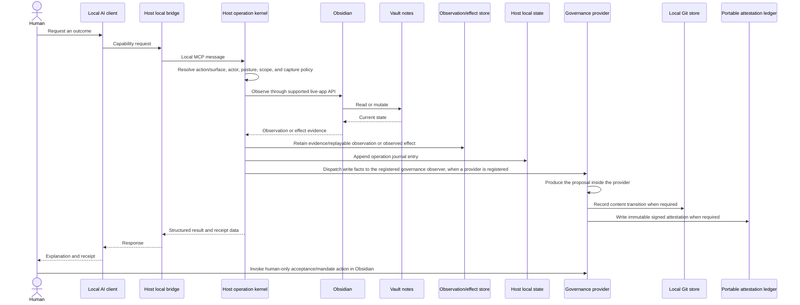

# Data flow

Governor is a local bridge between a compatible AI client and the Obsidian application already responsible for the vault. This document follows each data category through that system and names where the public boundary ends.

## System flow

The client may separately send prompts or retrieved content to a local or remote model provider. That path is configured and governed by the client, not Governor.

## Connection and discovery

### Input

- client name and version asserted descriptively during connection;
- requested mode, such as compact code-mode discovery;
- current vault identity; and
- capability discovery terms.

### Processing

Governor builds a connection-specific surface from the action registry, capability projection, live settings, dependencies, Obsidian version, and selected scope. Disabled or incompatible capabilities are absent or reported with a reason.

The surface is a projection. Every invocation resolves to a versioned action in the [Action registry](action-registry.md) and creates an operation envelope before live data is read.

### Storage

Governor's connection and actor binding is recorded on durable operation entries alongside the descriptive client claim. Advisory claims and in-memory retry keys last only for the plugin session unless a specific module documents persistent operational state.

Replayable and evidence observations record the Governor-derived binding. Ephemeral discovery and connection operations leave no durable response.

## Read request

### Input

A capability and bounded arguments, such as a search term, path, stable identity, tag, view, or scope.

### Processing

Governor normalizes and resolves references, enforces the path boundary, filters enumerations before reading, and asks Obsidian's live APIs or a documented module source for the result.

The operation's action contract determines whether the resulting observation is ephemeral, evidence-only, or replayable. Substantive reads inside governed sessions are replayable by default.

### Output

The client receives only visible results. A hidden direct target normally appears unresolved. Optional sources report unavailable rather than a false empty set. Ordering, omissions, truncation, and excluded/unavailable sources are part of the observation when material.

### Storage

Ephemeral reads leave no durable response. Evidence reads retain identities, source state, and result digests. Replayable reads retain or content-address the exact returned payload in local Governor storage. Client or provider logs remain outside Governor's guarantee.

## Mutation request

### Input

- capability identifier;
- registered action/version and invoking surface;
- target references;
- proposed content or structural arguments;
- revision precondition when applicable;
- retry-safety key;
- agent-stated intent;
- preview/apply choice;
- session id and Governor-issued actor binding;
- mandate reference, when delegated;
- claimed and computed change class; and
- cohort or verifier policy, when applicable; and
- durable observation ids supporting the plan, when applicable.

### Processing

Governor checks action and surface eligibility, posture, session, mandate, scope, observation sufficiency, change class, budgets, protected properties, record status, revision, idempotency, and advisory claims. A real mutation enters the single write queue, and the effect adapter uses the live Obsidian API when authorized. The host journals the write, then dispatches the write facts across the governance seam to the registered governance provider's observer, which produces the proposal inside the provider's own local Git history. The host then observes the landed effects and runs the documented postcondition and class-specific verification operations.

### Output

The client receives a result and standard operation receipt. The receipt names action, operation, source observations, intended/attempted/observed effects, session, mandate, class, proposal or cohort subject, verification, and standing. Judgment-bearing changes appear in the review center.

### Storage

The operation journal records reduced arguments, targets, Governor-derived actor binding, duration, queue wait, revisions, outcome, effect references, and intent. It does not embed note bodies. The observation/effect store retains replayable payloads and durable evidence separately. Git stores content history and proposal refs. Review state stores indexes and local standing refs. Immutable attestations record proposal, mandate, verification, admission, revocation, and replica-effect claims.

## Human review

Review gestures occur in Obsidian, not through the agent connection.

- **Accept proposal or cohort** revalidates the exact subject, records the human gesture, and admits it.
- **Accept mandate** activates bounded prospective authority for named verified results.
- **Request changes** stores feedback in the revision workflow.
- **Revert** restores prior reviewed state.
- **Revoke**, **expire**, or **supersede** preserves history without conferring new standing.

The pending index exposes a scope-filtered read view to agents so they can avoid conflicting work. It contains path and review metadata, not authority to decide the queue.

Session lifecycle and refusal state now live in different places. The host owns a session lifecycle log (`sessions.jsonl` in the host's plugin directory) recording `opened`, `closed`, and `expired`, plus its own pure expiry floor that needs no store and no provider. The governance provider owns only refusal state — revocation and session-to-mandate attachment — in its own `governance/sessions.jsonl`, and answers the seam's refusal hook from that file alone; no connection-lifecycle notification travels across the seam. One consequence: the provider no longer witnesses a session's `opened` event, so **Revoke** and mandate attachment now act on a session id without a prior `opened` record on file — a deliberate loosening, safe because revocation can only add refusals and because mandate fit already binds by session id rather than by the session record.

## Data inventory

| Category | Source | Read by | Stored by Governor | Sent outside machine by Governor |
|---|---|---|---|---|
| Note body | Vault | Requested capability within scope | Not in journal; may exist in review baseline, Git history, or a replayable observation | No in core public design |
| Replayable observation payload | Governor response after scope | Review, recovery, and dependent governed operations | Content-addressed local operation storage; may reference an in-scope Git blob | No |
| Paths and stable identifiers | Vault/arguments | Governor and connected client | Journal, receipts, pending index | No in core public design |
| Properties, tags, and links | Obsidian metadata | Requested capability within scope | Review baseline when needed | No in core public design |
| View results | Obsidian Bases, through the `vault-bases` satellite plugin (one of this plugin's modules until the S7 extraction) | Connected client | Evidence metadata or exact replay payload according to capture policy | No in core public design |
| Client label and Governor actor binding | Client/connection registrar | Governor | Mutation journal, session, attestations | No in core public design |
| Agent intent | Client | Review center | Journal | No in core public design |
| Settings | Human | Governor | Plugin data | No |
| Acceptance baseline/history | Human review | Governor | Plugin data | No |
| Journal | Governor | Human/support tools | Plugin data | No unless user exports it |
| Operation links and observation/effect manifests | Governor | Review, agents within scope, support tools | Plugin/local data; payloads outside ordinary Sync | No unless user exports them |
| Git objects and refs | Governor/local vault changes | Governor and user-selected Git tools | Local Git directory outside Sync | No |
| Mandate, verification, admission, and revocation attestations | Human/Governor/verifiers | Governor and review UI | Local ledger; optional immutable portable copies | No, except through user-configured Sync transport |
| Sync arrivals and conflict files | Obsidian Sync | Obsidian and Governor replica reconciler | Vault and local Git history | Obsidian Sync service under the user's account |
| Model-provider prompt | Client | Client/provider | Not controlled by Governor | Provider-dependent |

## Local storage

Governor uses the vault's configured plugin directory or application-appropriate local data location; it must not hard-code `.obsidian` when Obsidian exposes a configurable directory.

Typical state includes:

- settings;
- install identity;
- monthly journal files;
- observation/effect manifests and replayable response objects;
- review baselines and history;
- pending review index;
- module-specific operational state such as coordination receipts (the cross-session read receipts moved out of this plugin's directory with the `vault-crosssession` satellite at S6 — see [crosssession.md](crosssession.md); they are still plugin-directory state, just that plugin's);
- persisted rename evidence when needed for mechanical verification;
- local Git objects and proposal/standing refs outside the Sync file set;
- signing-key registrations and revocations; and
- immutable attestation envelopes.

These are operational records, not ordinary notes. The Git object database never relies on Obsidian Sync. Small immutable attestation envelopes may sync only when the user enables portable-standing mode and community-plugin data synchronization on each device.

## Obsidian Sync flow

Obsidian Sync transfers modified files individually and may deliver a multi-file cohort in any order. On receipt, Governor imports file changes into local Git history as external or Sync-attributed changes without inventing a human or agent author. It validates portable attestations independently.

A cohort remains **receiving** until every subject digest matches. If Sync merges a file or creates a conflict file, the result is a new subject: earlier verification and admission no longer cover it. Governor never auto-reverts a Sync-attributed change and never reports partial arrival as partial standing.

See [Git, Sync, and portability](git-and-sync.md).

## Optional integrations

An optional integration must add a row to this data-flow contract before release:

| Required disclosure | Example question |
|---|---|
| Remote service | Which host receives data? |
| Data categories | Bodies, paths, properties, tokens, or derived summaries? |
| Trigger | User action, schedule, or background event? |
| Default | Off or on? |
| Scope | Which notes or outside-vault roots? |
| Authentication | Where are secrets stored? |
| Retention | What remains locally and remotely? |
| Server telemetry | What usage or diagnostic data is collected? |
| Deletion | How does the user remove local and remote state? |
| Recovery | What happens after partial or failed synchronization? |

If the integration cannot answer these questions, it is not ready for the public distribution.

## Data minimization rules

- Filter by scope before reading, not after building an unbounded result.
- Capture the filtered response, never the pre-scope candidate set.
- Prefer metadata and excerpts when a full note body is unnecessary.
- Never write note bodies to the audit journal.
- Do not put secrets in intent, receipts, paths, or generated examples.
- Cap large result sets and report truncation.
- Report unknown as unknown, not zero.
- Remove stale operational indexes when their publishing module is disabled.
- Do not retain exact payloads for plumbing operations that cannot support governed work.

## Retention and deletion

The human owns retention. Whole journal months can be pruned after evidence requirements are met. Replayable payloads and evidence manifests follow their configured retention and may be held while proposals, verification, incidents, or standing depend on them. Pending indexes are rebuilt and removable. Baseline/history retention must preserve promised review and recovery behavior. Module state is cleared when the user explicitly resets or removes the module.

Uninstalling Governor leaves notes untouched. Plugin-owned data may remain until manually removed. See [Privacy](../PRIVACY.md) and [Troubleshooting](troubleshooting.md#uninstall-and-recovery).

## Failure behavior

- A read dependency failure returns unavailable.
- A denied mutation changes nothing and receives a typed error.
- A revision conflict changes nothing.
- A partial batch names completed and failed items.
- A timeout may be uncertain and requires re-read.
- A journal failure does not erase a completed vault mutation; it degrades audit health.
- A required observation payload or integrity failure blocks evidence-dependent work; Governor never synthesizes historical playback from current state.
- A client disconnect does not convert a proposal into admitted standing.
- A partial Sync arrival does not convert part of a cohort into admitted standing.

This separation prevents a transport failure, storage failure, or missing module from being misreported as a trustworthy business result.
