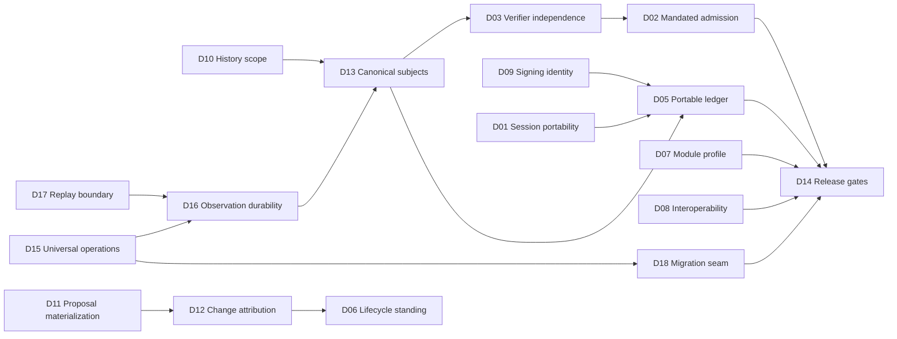

# Governor design decision register

Status: settled by Nelson  
Date: 2026-08-20  

## Purpose

This register isolates the choices that must be settled before agents receive a development guide and begin parallel codebase work. It is the decision companion to *Governor — a multi-perspective review* (a dated review artifact preserved in the operator's vault as evidence; per the migration map, versioned review artifacts are never the canonical owner of product facts and are not part of this repository's corpus) and is deliberately shorter than the full documentation suite. Each decision includes a recommendation, credible alternatives, consequences, and the documents or implementation contracts it controls.

The recommendations are conservative about authority and aggressive about preserving a usable human workflow. They aim for the smallest coherent first implementation while keeping the long-term Git, attestation, and Sync architecture intact.

## How to decide

For each item, mark one outcome:

- `[x] Adopt recommendation`
- `[x] Choose alternative B` or C
- `[x] Modify` and write the replacement decision
- `[x] Defer` only when the first implementation does not depend on it

You can also respond conversationally—for example, “Adopt D01–D06; use B for D07; modify D10 as follows.” The settled answer will then be written into the owning documentation before the agent development guide is produced.

## Already settled—not reopened here

These are load-bearing decisions already expressed consistently across the suite:

- Governor is the product name. Its plugin identity is no longer singular in realization: since the S3c host/provider split the governance provider package (`packages/governor`) keeps the Obsidian plugin id `governor`, while the MCP host ships separately as `packages/host`, plugin id `vault-mcp`. See `docs/suite-split-design.md` §8.
- The name refers to the regulating mechanism in an engine.
- Obsidian remains the visible human surface and live application authority.
- The four public postures are Looking only, Drafting a change, Proposing governed changes, and Working under a mandate.
- Acceptance is a human authority act over an exact proposal/cohort or bounded prospective mandate.
- Admission is Governor-only; no agent can accept, admit, choose identity, activate or widen a mandate, sign as the human, or advance standing.
- Sessions, mandates, and cohorts are different objects.
- Cohorts are immutable exact manifests; dynamic session/folder/collection queries only select them.
- Encoding, presentation, representation, structural, content, and authority are the six change classes.
- Scale and consequence are orthogonal to change class.
- Standing predicates require exact subject coverage; sampling may supplement an audit but does not replace required verification.
- Git is the content-history and transition engine, not identity or authority.
- Git author and committer strings are descriptive only.
- Proposal, mandate, verification, admission, revocation, and effect are separate signed claims.
- Obsidian Sync is file-level transport, not a transaction, backup, or authority service.
- Partial or conflicted Sync never creates partial standing.
- Git objects and private signing keys never travel through Obsidian Sync.
- The normal threat model does not defend against root, administrator, or same-user malicious-process compromise.
- Actions are stable postcondition contracts; operations are invocations; tools and UI controls are surfaces.
- Every Governor invocation uses the operation contract, with selective rather than universal durability.
- Governor guarantees replay only for observations and effects crossing its own boundary.

Changing one of those requires reopening the target architecture, not merely choosing an implementation detail.

## Decision overview

| ID | Question | Recommended answer | Status |
|---|---|---|---|
| D01 | Can a session move between replicas? | No in v1; sessions are replica-local but globally identifiable and linkable | Adopted |
| D02 | Which mandates may admit automatically? | Only fully verifiable encoding, presentation, representation, and tightly bounded structural work | Adopted |
| D03 | What counts as verifier independence? | Separate versioned verifier from the author; stronger separation for content/authority | Adopted |
| D04 | Does portable standing import historical acceptance? | No; portable standing begins prospectively | Adopted |
| D05 | How is the portable ledger stored and compacted? | Immutable envelope set with per-replica append-only segments; no destructive v1 compaction | Adopted |
| D06 | What happens to standing after rename, deletion, or restore? | Preserve history; require an admitted transition for every new subject | Adopted |
| D07 | Which modules ship publicly? | Small core, bounded read/report optionals, operator-specific and opaque modules private | Adopted |
| D08 | Which Git/attestation details are interoperability promises? | Stable exported subjects/envelopes/bundles; internal refs remain versioned implementation details | Adopted |
| D09 | How are signing identities held and recovered? | Per-device protected signing keys, explicit pairing, optional encrypted key recovery export, revocation and re-enrollment | Adopted |
| D10 | What content does the Git repository track? | One vault-root repository with a stable human-chosen history scope, separate from connection scopes | Adopted |
| D11 | Where do unadmitted proposals live? | In the visible vault working tree, with admitted standing held separately | Adopted |
| D12 | How are human, plugin, filesystem, and Sync edits attributed? | Observed editor changes may be human; all other non-Governor changes are external until reconciled | Adopted |
| D13 | What exactly is hashed as a proposal/cohort subject? | Versioned canonical manifest with stable identities, relevant paths, base/result digests, class, and transformation | Adopted |
| D14 | What is the first implementation/release cut line? | Local individual/cohort authority first; mandates and portable standing follow evidence | Adopted |
| D15 | Is the execution architecture universal or mutation-only? | Every invocation is an operation; durability is selected separately | Adopted |
| D16 | Which observations are retained? | Replayable substantive reads in governed sessions; evidence when sufficient; plumbing/navigation ephemeral | Adopted |
| D17 | What does playback guarantee? | What Governor returned or observed, not model reasoning or external context | Adopted |
| D18 | How does the current repository migrate? | Introduce an operation seam first; native new work plus conservative compatibility adapter; no big-bang rewrite | Adopted |

## Decisions

### D01 — Session portability across replicas

#### Question

Can a session begun on one desktop be resumed as the same authoritative session on another replica?

#### Recommendation

**Sessions are replica-local in the first implementation.** Session identifiers are globally unique and may carry `continuedFrom` or `relatedSession` links, but another device opens a new session with its own actor binding, base state, local Git history, expiry, and effect receipts.

An attestation or cohort may be portable; the live session capability is not.

#### Why

- A session binds a connection, local actor, base state, queue, and current replica.
- Obsidian Sync does not provide atomic transfer of those runtime facts.
- Portable session capabilities create replay and stolen-token problems without adding much user value.
- Linked sessions preserve continuity without pretending two devices share one execution context.

#### Alternatives

**B. Fully portable session** — sync encrypted session capability and resume anywhere. Better continuity; substantially harder identity, expiry, replay, and concurrent-use model.

**C. Human-reissued continuation** — allow another device to resume only after a fresh local human gesture. Safer than B, but still needs cross-replica locking and base reconciliation.

#### Consequences

The UI says “continue this work in a linked session” rather than “resume the same session” on another device. Cohorts may combine related sessions only by freezing a new exact manifest.

#### Controls

Architecture, session schema, receipts, replica reconciler, agent guide, Sync tests.

#### Decision

- [x] Adopt recommendation
- [ ] Choose B
- [ ] Choose C
- [ ] Modify:

### D02 — Automatic admission under mandates

#### Question

Which change classes may a public mandate authorize Governor to admit without a later cohort click?

#### Recommendation

Permit automatic mandated admission only for:

- encoding;
- presentation;
- named representation transformations with complete information-preservation verification; and
- tightly bounded structural transformations whose identity, content, link, scope, and recovery invariants are fully verified.

Content work may be delegated and produced under a mandate, but it returns for human cohort acceptance. Authority changes always use a direct human authority path and are never hidden inside automatic admission.

The first implementation should run even eligible mandates in **cohort-decision mode** until their verifiers and recovery paths have live evidence. D14 governs promotion to automatic admission.

#### Why

Mechanical invariants can be checked over every exact subject. Substantive correctness generally cannot. This preserves the useful distinction between permission to do content work and authority to make the result standing.

#### Alternatives

**B. No automatic admission in the public product** — mandates authorize production only; every cohort receives a human click. Safest and simplest, but reintroduces repetitive review for well-proven transformations.

**C. Permit content admission with an independent verifier** — maximizes autonomy, but turns verifier quality and source sufficiency into an authority boundary that is difficult to explain or prove.

#### Consequences

The mandate schema separates `mayProduce` from `mayAdmit`. Mixed-class work splits before admission. Any class escalation blocks the lower-class mandate.

#### Controls

Review model, mandate schema, change-class registry, verifier policy, capability manifest, Community boundary.

#### Decision

- [x] Adopt recommendation
- [ ] Choose B
- [ ] Choose C
- [ ] Modify:

### D03 — Verifier independence

#### Question

What does it mean for verification to be independent of the authoring agent?

#### Recommendation

Use a graduated definition:

| Change class | Minimum independence |
|---|---|
| Encoding | Deterministic, separately versioned verifier; may run in Governor's process |
| Presentation | Deterministic semantic/structured comparator, separately versioned from author |
| Representation | Separately versioned transformation-specific verifier with full source/destination coverage |
| Structural | Separately versioned identity/link/scope verifier using live Obsidian state |
| Content | Human substantive decision or separately bound qualified reviewer; the author is never the sole verifier |
| Authority | Human gesture/mandate plus Governor policy validation; never author-verified |

“Separately versioned” means the predicate implementation and fixtures are identifiable independently of the authoring agent or prompt. It does not imply process or machine isolation. Stronger hardened profiles may require another process, key, or device.

#### Why

This provides real separation from model self-approval without pretending that two functions in one local process defeat same-user compromise.

#### Alternatives

**B. Separate process for every verifier** — stronger fault isolation; much higher operational and packaging burden.

**C. Same agent may verify lower classes** — simpler, but collapses author claim and verifier evidence and weakens the attestation model.

#### Consequences

Verifier identity includes predicate id, version, implementation digest, key or service binding, coverage, and assurance level. Receipts must not say “independent” without naming the applicable level.

#### Controls

Verifier registry, attestation predicates, threat model, test fixtures, reviewer notes.

#### Decision

- [x] Adopt recommendation
- [ ] Choose B
- [ ] Choose C
- [ ] Modify:

### D04 — Historical acceptance and portable standing

#### Question

Should portable standing begin only with new Governor attestations, or should existing acceptance state be imported as portable authority?

#### Recommendation

**Begin portable standing prospectively.** Import existing properties, baselines, and review history as `legacy-import` evidence with source and timestamp where known. Do not fabricate human signatures, verification predicates, or admission claims.

The human may re-accept selected current subjects or frozen legacy cohorts, producing new attestations from that point forward.

#### Why

Historical state can be valuable without pretending it was created under rules that did not exist. Prospective adoption makes the trust root comprehensible and auditable.

#### Alternatives

**B. Treat every existing accepted property as standing** — lowest migration effort; vulnerable to stale, malformed, or agent-written properties and false provenance.

**C. Require re-acceptance of the entire governed corpus** — strongest clean break; potentially creates an enormous one-time review burden.

#### Consequences

Legacy records remain readable and locally useful. Portable authority begins at a dated cutover. The migration UI should support selective re-acceptance rather than one vault-wide decision.

#### Controls

Migration schema, documentation basis, contradiction register, portable ledger, review UI.

#### Decision

- [x] Adopt recommendation
- [ ] Choose B
- [ ] Choose C
- [ ] Modify:

### D05 — Portable-ledger storage and compaction

#### Question

How should immutable attestations be stored in community-plugin data so replicas can merge them safely?

#### Recommendation

Make the **logical envelope set** canonical, not any one mutable index file.

- Each envelope is immutable and content-addressed.
- Each replica writes only to its own append-only segment or partition.
- Reconciliation is set union by envelope digest, followed by signature, subject, expiry, and revocation validation.
- Mutable indexes are rebuildable projections, never authority.
- A checkpoint may summarize prior segments but cannot erase revocation or provenance meaning.
- The first portable release performs no destructive compaction. Pruning requires an exported recovery bundle, verified backup, and explicit retention policy.

Before fixing the physical layout, run a live two-replica spike to confirm exactly which plugin-data files Obsidian Sync transports and how conflicts are exposed. The storage adapter may use per-replica files or a partitioned plugin-data object, but it must preserve the envelope-set semantics above.

#### Why

A single concurrently edited mutable `data.json` is easy to lose or conflict. One-writer replica partitions and content hashes make duplicate and reordered delivery normal rather than exceptional.

#### Alternatives

**B. One append-only JSONL ledger** — simple locally; concurrent Sync edits and conflict merging are riskier.

**C. One envelope per ordinary vault file** — strong merge behavior; pollutes the visible vault and may expose authority metadata outside expected plugin storage.

#### Consequences

Portable state is eventually consistent. A local index can be deleted and rebuilt. Storage behavior remains an adapter detail, while envelope and checkpoint semantics are versioned.

#### Controls

Ledger schema, plugin-data adapter, Sync reconciler, retention, backup/export, corruption tests.

#### Decision

- [x] Adopt recommendation
- [ ] Choose B
- [ ] Choose C
- [ ] Modify:

### D06 — Standing across rename, deletion, and restoration

#### Question

What happens to standing when a note moves, disappears, or returns from history or Sync?

#### Recommendation

- **Governor-admitted rename or move:** create and admit a structural transition. Preserve stable identity and content standing only after path-dependent policy, collection membership, links, and scope invariants pass.
- **External or Sync rename:** treat the destination as a new current subject; verify and admit the structural transition before standing follows.
- **Deletion or missing file:** retain historical admission but mark the current realization `missing` or `suspended`; do not rewrite history as revoked.
- **Restoration of exact previously admitted bytes:** record a new effect and require policy validation; do not automatically revive expired or revoked authority.
- **Restoration with any different bytes or path-sensitive meaning:** create a new subject requiring verification and admission.

#### Why

History, current realization, and authority are different facts. A disappearance does not prove revocation, and a byte restoration does not prove that old policy should become active again.

#### Alternatives

**B. Stable identity always carries standing across moves** — convenient, but unsafe when location changes archive status, policy reach, collection meaning, or access.

**C. Any path change permanently loses standing** — simple and conservative, but makes verified link-aware reorganization unnecessarily expensive.

#### Consequences

Standing refs address stable identity plus an admitted subject, not path alone. Structural predicates declare whether path and containment are semantically relevant.

#### Controls

Subject schema, identity index, structural verifier, Git transition service, Sync reconciler, recovery UI.

#### Decision

- [x] Adopt recommendation
- [ ] Choose B
- [ ] Choose C
- [ ] Modify:

### D07 — Public, optional, and private module profile

#### Question

Which current modules belong in the initial Community product rather than the private operator system?

#### Recommendation

##### Public core

- acceptance/review/admission;
- write kernel, receipts, journal health, and recovery;
- stable identity and link-health reads;
- basic search, note, property, link, history, diff, navigation, and availability capabilities;
- capability/module discovery and shared external-publisher guard, with no publisher trusted by default.

##### Public optional, disabled until configured or supported

- Bases read evaluation (now ships as the separate `vaultmcp-bases` satellite plugin — see [bases.md](bases.md) and `docs/suite-split-design.md` §6);
- scheme resolution and preview-first bounded placement;
- vocabulary validation (now ships as the separate `vaultmcp-vocab` satellite plugin — see [vocabulary-module.md](vocabulary-module.md) and `docs/suite-split-design.md` §6);
- conformance reporting;
- health and survey reports (the health scan now ships as the separate `vaultmcp-health` satellite plugin — see `docs/suite-split-design.md` §6; survey stays in this plugin);
- Fileclass inspection and named representation proposals when a supported dependency exists (now ships as the separate `vaultmcp-fileclass` satellite plugin — see `packages/fileclass/README.md` and `docs/suite-split-design.md` §6);
- provenance inspection and staleness reports, but not unconstrained regeneration (now ships as the separate `vaultmcp-provenance` satellite plugin — see [provenance.md](provenance.md) and `docs/suite-split-design.md` §6).

##### Private/operator in the first release

- skills/policy compilation and export (now ships as the separate `vaultmcp-skills` satellite plugin — see [skills.md](skills.md) and `docs/suite-split-design.md` §6);
- cross-session fleet coordination (now ships as the separate `vaultmcp-crosssession` satellite plugin — see [crosssession.md](crosssession.md) and `docs/suite-split-design.md` §6);
- JD scaffolding (now ships as the separate `vaultmcp-jd-scaffold` satellite plugin — see `packages/jd-scaffold/README.md` and `docs/suite-split-design.md` §6);
- triage mutations (now ships as the separate `vaultmcp-triage` satellite plugin — see [triage.md](triage.md) and `docs/suite-split-design.md` §6);
- QuickAdd execution bindings;
- provenance regeneration with external outputs (one tool inside the separate `vaultmcp-provenance` satellite plugin);
- opaque or pathless third-party mutations;
- every advanced capability pack already excluded by the public contract.

Any private item may later be promoted only through its own manifest, threat, recovery, clean-vault value, and Community review.

#### Why

This preserves a useful public product independent of the private agent fleet and vault conventions. It favors deterministic read/report modules and withholds convention-heavy or externally mutating machinery.

#### Alternatives

**B. Ship every inspectable module as optional public code** — more capability and one bundle; larger review, performance, dependency, and support surface.

**C. Ship only core notes/review, no optional knowledge modules** — easiest first review; loses much of Governor's distinct knowledge-management value.

#### Consequences

The public bundle inventory becomes exact. Private modules must be absent, not merely disabled. Documentation and tests generate from the chosen distribution field.

#### Controls

Module manifests, build graph, capability directory, settings, threat model, submission packet.

#### Decision

- [x] Adopt recommendation
- [ ] Choose B
- [ ] Choose C
- [ ] Modify:

### D08 — Stable interoperability boundary

#### Question

Which Git, subject, attestation, and bundle details may external tools rely on?

#### Recommendation

Promise stability for:

- ordinary Markdown and attachments;
- standard Git object compatibility;
- exported Governor bundle layout and manifest version;
- canonical proposal/cohort subject schema and digest algorithm;
- attestation envelope, statement, predicate type, and version identifiers;
- key identifiers, signature algorithms, revocation semantics, and checkpoint rules; and
- a read-only export/API that resolves standing without requiring internal refs.

Keep these internal and versioned without compatibility guarantees:

- Git ref names and namespace layout;
- journal file layout;
- mutable indexes and caches;
- UI state;
- queue/idempotency storage; and
- module-internal operational records.

No external tool should advance Governor refs directly.

#### Why

This provides real exit and interoperability guarantees without freezing the internal implementation before it has operating experience.

#### Alternatives

**B. Make Git refs the public API** — easy integration; permanently couples authority to storage internals and invites unsafe writes.

**C. Promise only Markdown portability** — simplest, but abandons portable evidence and standing reconstruction.

#### Consequences

Every stable format carries an explicit version and migration path. Export/import tests become part of release evidence.

#### Controls

Subject and attestation schemas, export bundle, developer SDK, migration policy, compatibility tests.

#### Decision

- [x] Adopt recommendation
- [ ] Choose B
- [ ] Choose C
- [ ] Modify:

### D09 — Signing identity and key recovery

#### Question

How does a nontechnical user keep, add, lose, recover, or revoke signing authority?

This decision does **not** add vault or note encryption. Governor signs small claims about exact digests so another replica can validate who issued them. The only encryption proposed here protects an optional backup of a private signing key.

#### Recommendation

- Generate one signing key per authorized device or verifier role.
- Store private keys in operating-system protected secret storage, not notes, Git, journal, plugin Sync data, or ordinary settings.
- Register public keys and roles through an explicit human gesture.
- Add a new desktop through a displayed pairing flow; never infer that Sync possession grants signing authority.
- Offer an optional encrypted recovery export stored outside the live vault and Sync remote.
- If a key is lost without recovery, register a new key through human re-authorization and revoke the old key. Do not recreate its identity or backdate signatures.
- Treat key rotation, revocation, and last-known-good trust state as first-class review events.

#### Why

Per-device keys limit blast radius and give receipts meaningful signer identity. Explicit pairing keeps Sync transport separate from authority.

#### Alternatives

**B. One human key synced among devices** — simpler identity; private key transport and compromise blast radius are worse.

**C. No cryptographic keys; local installation identity only** — simpler product; weak portable verification and revocation.

#### Consequences

Losing a device does not erase historical evidence. Recovery restores capability only when the user possesses the encrypted export or performs a new authorization.

#### Controls

Key store, principal and role registry, pairing UI, attestation validator, backup/recovery, incident guide.

#### Decision

- [x] Adopt recommendation
- [ ] Choose B
- [ ] Choose C
- [ ] Modify:

### D10 — Git repository and history scope

#### Question

Does Governor track the entire vault, each connection's scope, or a separate configured subset?

#### Recommendation

Use **one vault-root Git worktree** with a separate, stable, human-chosen **history scope**.

- Repository identity belongs to the vault, not to a connection or session.
- Connection scopes govern what one client may access; they never change what history already records.
- Setup asks the user to choose whole-vault history or explicit included/excluded roots after disclosing that Git retains historical bytes.
- For the intended “vault = repository” portability model, recommend whole ordinary-vault content while excluding volatile caches, local secrets, the Git object database, and explicitly private roots.
- A connection cannot expand history scope. Changing history scope is a human settings and retention decision.
- Operations crossing tracked/untracked boundaries must disclose incomplete history and may be ineligible for automatic admission.

#### Why

Using connection scope as history scope makes Git trees unstable and can silently lose move, link, and recovery context. One repository preserves vault-level identity while a distinct history policy protects privacy.

#### Alternatives

**B. Track the entire vault unconditionally** — simplest and most portable; surprising privacy and storage consequences.

**C. Track only files changed by Governor** — minimizes retention; produces incomplete history and weak recovery for external or Sync changes.

#### Consequences

README, Privacy, onboarding, retention, and uninstall behavior must name the history scope separately from agent scope. Exclusion changes need migration and pruning semantics.

#### Controls

Repository service, onboarding, ignore rules, privacy policy, move/recovery logic, backup/export.

#### Decision

- [x] Adopt recommendation
- [ ] Choose B
- [ ] Choose C
- [ ] Modify:

### D11 — Proposal materialization

#### Question

Do unadmitted agent proposals appear directly in the vault's visible working tree, or remain isolated until accepted?

#### Recommendation

Keep proposals in the **visible Obsidian working tree**, as the existing review model expects. Git and Governor standing refs retain the admitted baseline separately.

- Obsidian shows the current proposed bytes so the human can inspect them in context.
- The review center clearly marks affected notes and offers admitted/proposed comparison.
- Governor-aware agents and generated authority projections use standing APIs rather than treating raw current bytes as admitted.
- Ordinary Obsidian and third-party views are documented as current-content views, not standing views.
- A setting may show unobtrusive note/ribbon status for proposed or conflicted material.

#### Why

Separate proposal branches or worktrees would make ordinary Obsidian review awkward, break active editor context, and create constant checkout/switching complexity. The visible working tree preserves the product's core promise that Obsidian is where the work can be seen.

#### Alternatives

**B. Isolated Git proposal worktrees** — clean authority separation; poor in-app usability and complex link/workspace behavior.

**C. In-memory or database proposals applied only on acceptance** — avoids raw-vault divergence; turns Obsidian into a preview target rather than the live work surface and complicates broad diffs.

#### Consequences

The product must be candid that current bytes and standing may differ. Standing-aware consumers need an explicit API; raw vault readers receive current working content.

#### Controls

Review UI, standing resolver, Git refs, status indicators, agent guide, external publisher contract.

#### Decision

- [x] Adopt recommendation
- [ ] Choose B
- [ ] Choose C
- [ ] Modify:

### D12 — Attribution of manual and external changes

#### Question

How does Governor distinguish a human edit in Obsidian from another plugin, filesystem process, or Sync arrival?

#### Recommendation

Use explicit origin classes and avoid false cryptographic claims:

- **Governor-originated** — bound to its connection/session and governed proposal path.
- **Local-human-observed** — editor-buffer change observed while the local user is actively editing through Obsidian; may establish immediate local human standing under a configured policy, but is labeled observed rather than cryptographically proven.
- **Sync-attributed** — arrival reported through replica reconciliation; authority follows portable evidence, never presumed human.
- **External/unattributed** — filesystem, other plugin, or indeterminate change; record it in Git, mark prior standing stale where the subject changed, and route it for reconciliation.

The default public policy should trust local-human-observed editor changes as the user's own work for usability, within the documented same-user threat model. Ambiguous external changes may be accepted as an exact cohort through a lightweight “Treat these as my changes” review action.

#### Why

Treating every non-Governor write as human grants accidental plugins authority. Treating every local edit as untrusted turns ordinary typing into review debt. Origin classes preserve useful confidence without pretending that the local runtime is adversarially isolated.

#### Alternatives

**B. Every non-Governor change requires review** — clearest safety model; likely unusable for a normal Obsidian workflow.

**C. Every local non-Sync change is human** — simplest; silently grants other plugins and filesystem automation human standing.

#### Consequences

The implementation needs editor-event attribution and explicit fallback to external/unattributed. Receipts and attestations name the origin confidence. The threat model states that another same-user malicious plugin can still imitate local behavior.

#### Controls

Obsidian adapter, origin classifier, Git importer, review UI, standing policy, threat model, external-change tests.

#### Decision

- [x] Adopt recommendation
- [ ] Choose B
- [ ] Choose C
- [ ] Modify:

### D13 — Canonical proposal and cohort subjects

#### Question

What exact data is hashed and signed when Governor says an attestation covers a proposal or cohort?

#### Recommendation

Define a versioned canonical manifest independent of Git commit serialization.

Each proposal item includes:

- subject-schema version;
- vault and stable note identity;
- path only when required for display or when path/containment is part of the predicate;
- base content/blob digest;
- proposed content/blob digest;
- relevant attachment or side-effect digests;
- exact change class or combination;
- transformation id and version;
- required verifier predicate ids and versions;
- session and mandate references where applicable; and
- explicit absence markers for optional fields.

A cohort includes the exact canonical item manifests, sorted by stable identity plus deterministic tie-breaker, along with scope resolution, exclusions, recovery unit, and cohort-schema version. Use one documented canonical UTF-8 serialization with fixed Unicode, field, number, and array rules. Any schema or canonicalization change creates a new version and digest.

Git object ids may appear as supporting evidence but are not the only subject because Git commits include metadata irrelevant to authority.

#### Why

Signatures and full-coverage verification are meaningful only when every producer computes the same subject bytes. This is a security contract, not a convenience serializer.

#### Alternatives

**B. Use Git commit/tree ids directly** — simple and standard; insufficient for class, predicate, mandate, exclusions, and path-relevance semantics.

**C. Sign a mutable database record id** — easy internally; not portable or independently verifiable.

#### Consequences

Canonical fixtures become foundational tests shared by proposal, cohort, verifier, attestation, bundle, and replica implementations.

#### Controls

Subject schema, canonicalizer, Git adapter, attestation predicates, export format, cross-language fixtures.

#### Decision

- [x] Adopt recommendation
- [ ] Choose B
- [ ] Choose C
- [ ] Modify:

### D14 — First implementation and release cut line

#### Question

Which parts of the target design must exist before the first usable implementation, and which should wait for evidence?

#### Recommendation

Use three gates:

##### Gate 1 — local governed authority

- Gate 0 operation registry, executor, schemas, compatibility adapter, and bidirectional surface inventory;
- generated capability and module projections from registered actions;
- existing safe read/write kernel reconciled with the new schemas;
- replayable governed observations and operation/effect receipts for the first vertical slice;
- local Git history scope and repository service;
- canonical proposal subjects;
- sessions;
- individual proposals, deterministic verification, receipts, human acceptance, Governor admission, revocation, and recovery;
- immutable human-decided cohorts;
- external/manual origin handling;
- no automatic mandated admission; and
- notes-only Sync compatibility.

##### Gate 2 — bounded delegation

- mandate drafting, counter-proposal, human activation, budgets, expiry, and revocation;
- automatic admission only for the D02-approved classes;
- live evidence from pilots and the 600-note representation fixture;
- crash recovery and rollback evidence.

##### Gate 3 — portable standing and public release

- key pairing and recovery;
- portable ledger;
- two-replica reordered, duplicate, partial, conflict, key-loss, and revocation evidence;
- final public/private bundle split;
- clean-vault onboarding, performance, accessibility, migration closure, and Community submission evidence.

Do not make Gate 3 a condition for learning whether Gate 1's authority model works locally. Do not publicly ship the full promise until the release status accurately states which gates are present.

#### Why

This follows one complete vertical slice at a time and prevents sessions, Git, attestations, review, and Sync from being built as disconnected subsystems.

#### Alternatives

**B. Implement the entire target before any user trial** — one conceptual launch; high integration and migration risk.

**C. Ship only documentation/manifest cleanup before authority changes** — lower technical risk; leaves the untenable review regime active longer.

#### Consequences

The agent development guide and issue graph should follow these gates. Status documentation must distinguish target behavior from the highest completed gate.

#### Controls

Development guide, implementation plan, issue milestones, status/compatibility, testing/release, migration closure.

#### Decision

- [x] Adopt recommendation
- [ ] Choose B
- [ ] Choose C
- [ ] Modify:

### D15 — Universal operation contract

#### Question

Does “operation” name only state-changing work, or every Governor invocation including reads and navigation?

#### Recommendation

**Every invocation is an operation.** Read, plan, mutation, verification, and authority actions use one execution contract. Durability is an independent action/session policy, so ordinary plumbing does not become a permanent log merely because it passed through the kernel.

#### Why

One contract gives every surface the same action identity, actor binding, scope derivation, availability, errors, and receipt semantics. Reads already participate in plans, verification, previews, and scope enforcement; a separate read architecture creates a seam exactly where evidence must remain traceable.

#### Alternatives

**B. Mutation-only operations** — smaller concept, but creates two routers and ambiguous preview/verification boundaries.

**C. Full workflow engine** — makes every operation a configurable graph; flexible but disproportionate and difficult to review.

#### Consequences

The action registry becomes the execution owner. Capabilities are projections and surfaces are bindings. Reads activate fewer phases and may remain ephemeral.

#### Controls

Action registry, operation contract, architecture, receipts, source-scan registration tests.

#### Decision

- [x] Adopt recommendation
- [ ] Choose B
- [ ] Choose C
- [ ] Modify:

### D16 — Observation durability and defaults

#### Question

What read evidence does Governor retain, and which observations may support later governed work?

#### Recommendation

Use three levels:

- **ephemeral** for low-information plumbing and UI navigation;
- **evidence** for identity/state/result-shape records whose declared fields are sufficient; and
- **replayable** for exact response payloads.

Substantive vault reads inside governed sessions are replayable by default. Verification and authority inputs are replayable. An ephemeral observation cannot support a proposal, verification result, or admission; Governor must re-observe durably before dependent work.

#### Why

Exact playback improves human review, incident reconstruction, agent handoff, and proof of read-scope enforcement. Selective durability avoids turning harmless handshakes and navigation into a sensitive permanent transcript.

#### Alternatives

**B. Evidence-only for all reads** — lower storage cost; cannot reproduce the material that informed judgment.

**C. Replay every read** — strongest history; excessive privacy and retention burden for plumbing operations.

#### Consequences

Observation capture becomes action policy, not caller preference. Replayable payloads require content-addressed local storage, retention controls, integrity checks, and explicit privacy disclosure.

#### Controls

Observation schema, settings, privacy, data flow, operation dependency validation, pruning rules.

#### Decision

- [x] Adopt recommendation
- [ ] Choose B
- [ ] Choose C
- [ ] Modify:

### D17 — Playback boundary

#### Question

Does Governor promise a complete reconstruction of an agent session or only its own mediated inputs and effects?

#### Recommendation

**Stop at Governor's boundary.** Governor guarantees the requests, effective scope, observations, plans, effects, verification, and authority evidence it produced or observed. External client transcripts may be linked as untrusted evidence but are not ingested into the core guarantee.

#### Why

Governor cannot prove a model's hidden prompt, private reasoning, attention, web browsing, messages, or non-Governor tool results. Claiming complete cognitive replay would be false and tightly couple the plugin to individual clients.

#### Alternatives

**B. Ingest compatible client traces** — richer context; large privacy, compatibility, and authenticity surface.

**C. Claim session reconstruction from operation history** — simple wording but materially misleading.

#### Consequences

UI language says “what Governor returned” rather than “what the agent saw or thought.” External trace references carry provenance and digests but no authority.

#### Controls

Observations/replay, agent guide, privacy, receipts, threat model, client-integration schema.

#### Decision

- [x] Adopt recommendation
- [ ] Choose B
- [ ] Choose C
- [ ] Modify:

### D18 — Operation-centric migration strategy

#### Question

Should the repository be rewritten around operations before feature work, left unchanged until later, or migrated through an early compatibility seam?

#### Recommendation

**Establish the seam early; migrate incrementally.** Add the action registry, operation schemas, executor, and conservative compatibility adapter before the new governance stack. New work uses the native operation contract. Existing tools migrate in risk order without a big-bang rewrite.

#### Why

Delaying the seam until after Git, sessions, cohorts, mandates, and attestations would freeze the entity-centric architecture into new code. Rewriting every current tool first would interrupt a working product and create a large unreviewable change.

#### Alternatives

**B. Big-bang refactor first** — clean cut; highest regression and integration risk.

**C. Build governance first, refactor later** — preserves short-term velocity; creates the wrong ownership boundaries and duplicate pipelines.

#### Consequences

Gate 0 precedes canonical subjects and Git. Compatibility actions receive conservative claims and cannot claim replayability, observed effects, mandate eligibility, or verified admission until their contracts are native and tested.

#### Controls

Coding-agent guide, migration register, bidirectional registry/runtime inventory, compatibility metrics, cutover tests.

#### Decision

- [x] Adopt recommendation
- [ ] Choose B
- [ ] Choose C
- [ ] Modify:

## Dependency order

Some choices constrain others:

The most efficient decision order is:

1. D10, D11, and D12 — establish what exists in the working tree and history;
2. D13, D03, and D02 — establish what is verified and may gain standing;
3. D01, D09, D05, and D06 — establish replica and lifecycle behavior;
4. D07 and D08 — establish the public and interoperability boundary; and
5. D15, D16, and D17 — establish the operation and observation contract;
6. D18 — establish the migration seam; and
7. D14 — confirm the development sequence.

## After the decisions

Once this register is settled:

1. update the owning target documents and contradiction register;
2. freeze the version-1 action, operation, observation, effect, subject, and authority schemas and invariants;
3. write the agent development guide against those exact decisions;
4. create the implementation issue graph and worktree strategy;
5. give each coding agent non-overlapping files or packages and one vertical acceptance target;
6. require independent review before integration; and
7. promote documentation claims only as implementation evidence lands.

The development guide should not ask coding agents to reinterpret this architecture. Their job will be to implement, test, and report against the settled contracts.
