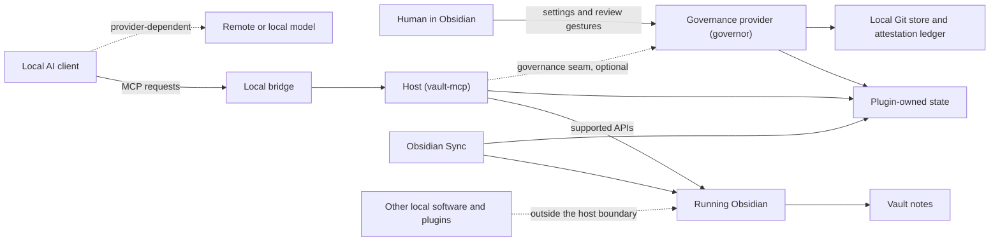

# Threat model

This threat model defines what Governor's public architecture is designed to resist, what it only detects, and what remains outside its boundary. It is a target-state security contract, not a completed audit report.

## Assets

- confidentiality of notes, attachments, properties, links, paths, and workspace context;
- integrity of note content and structure;
- human authority over acceptance and protected declarations;
- availability of the vault and local bridge;
- integrity and attribution of journals, receipts, baselines, and review history;
- integrity of the action registry, operation records, observation manifests, effect records, and replay bindings;
- integrity of Git objects and refs, sessions, mandates, cohort manifests, signer keys, attestations, and standing;
- confidentiality of replayable observation payloads, including historical note content returned to clients;
- confidentiality of historical bytes retained inside the human-chosen Git history scope;
- secrets used by optional integrations; and
- recoverability through note history and verified backups.

## Actors

### Human operator

Controls settings, scope, capability packs, review, acceptance, backup policy, and client registration. Human mistakes remain possible; the interface should make consequence and recovery visible.

### Connected AI client

May be correct, fallible, stale, confused by prompt injection, or compromised. Governor does not rely on the client voluntarily honoring read-only mode, scope, session binding, mandate limits, change class, protected properties, identity, or acceptance authority.

### Verifier

Applies a named predicate to an exact subject. It may be deterministic, misconfigured, buggy, compromised, or too weak for the claim. Governor trusts only registered keys and predicates named by the applicable human policy.

### Sync replica

Receives files and optional portable attestations in non-transactional order. It may be offline, stale, partially synchronized, or conflicted. Replica effect is not automatically standing.

### Note author or imported content

May contain instructions intended to redirect the agent. Content is untrusted data and confers no permission.

### Other Obsidian plugin

Runs with broad Obsidian privileges. A trusted plugin may provide a capability; a malicious plugin may bypass Governor entirely.

### Local process

May run as the same operating-system user. Owner-only socket permissions do not isolate Governor from such a process.

### Remote provider

May receive content through the connected client or an optional integration. Its behavior is governed by its own contract and configuration.

## Trust boundaries

The host mediates the solid request path by itself, including the local bridge and the MCP surface. The governance provider is reached only across the dotted governance seam and is itself optional and removable — the split's own design names this as its largest doctrinal cost. With no provider installed, seam consultations are vacuous and the vault works ungoverned — still journaled and allowlist-scoped, just not governed. The host's mitigation is narrow: once a provider id is registered as the active governance provider, the host refuses to toggle it off or uninstall it, so a human cannot silently defeat governance through the plugin manager alone. Neither component can mediate the dotted local-software path, and neither can guarantee what the client sends to its model provider.

## Security assumptions

- Obsidian and the operating system enforce ordinary local file permissions.
- The installed Governor release matches reviewed source and release assets.
- Human actions in Governor's review center are genuine local gestures.
- Settings and plugin data are not silently rewritten by a malicious local process.
- Registered signer keys and verifier policy have not been compromised.
- Backups exist independently and have been restoration-tested.

When one of these assumptions fails, Governor may still produce useful evidence but does not claim containment.

## Threats and controls

### 1. Excessive initial authority

**Threat:** Connecting a client immediately exposes the whole vault and full mutation surface.

**Controls:** Looking only default; no content scope until chosen; create/append and structural mutation disabled; dangerous operations absent publicly; capability availability derived per connection.

**Residual:** The plugin itself still has Obsidian's privileges. A malicious build can ignore its own settings.

### 2. Path traversal or hidden-path disclosure

**Threat:** A client names `..`, uses a stable identifier, searches globally, or exploits counts and errors to discover notes outside scope.

**Controls:** normalize vault-relative paths; check segment boundaries; resolve stable and scheme addresses before scope enforcement; filter enumerations before reading; return hidden targets as unresolved; refuse tools that cannot be honestly scoped.

**Residual oracles:** link resolution may reveal that some target exists; shortest unambiguous link text may reveal a basename collision; the client necessarily knows its own configured scope. These signals do not disclose the hidden path or content.

### 3. Stale overwrite

**Threat:** A human or another agent edits a note after the client read it, and a later write silently erases the change.

**Controls:** serialized mutation queue plus optional revision precondition checked when the operation reaches the front of the queue.

**Residual:** A caller may choose an unconditional last-write-wins operation where the capability permits it. Public guidance requires revision checks for read-modify-write work.

### 4. Duplicate retry

**Threat:** A lost response causes a client to repeat an append or create.

**Controls:** bounded in-memory idempotency keys identify the logical operation, its arguments, and revision precondition; in-flight duplicates share the first result.

**Residual:** Keys expire and clear on plugin restart. An abandoned timeout does not retain the key because the underlying effect is unknown.

### 5. Timeout ambiguity

**Threat:** Governor stops waiting, reports failure, and the write lands later; a retry duplicates it.

**Controls:** explicit uncertain outcome, required re-read, corrective journal record on late settlement, and receipt recovery instructions.

**Residual:** The underlying Obsidian or third-party operation may not be cancelable. Exactly-once execution is not claimed.

### 6. Acceptance forgery

**Threat:** An agent uses a write, body-embedded frontmatter, escaped CLI payload, template, plugin extension, fabricated mandate, Git author name, or attestation to assert accepted state.

**Controls:** no accept- or admit-capable agent API; Governor-derived actor and session binding; accepted-family transition guard at the shared write primitive; recognition parity with honored frontmatter; protected name tripwires; opaque and dynamic paths excluded from the public surface; human-only mandate/acceptance gesture; trusted signer and predicate registry; exact subject binding; Governor-only standing ref advancement.

**Residual:** Another fully privileged plugin or process can edit files or plugin state outside Governor. The public distribution therefore excludes generic command and arbitrary code execution rather than claiming complete mediation.

### 7. Protected-property stripping

**Threat:** An agent removes or changes a human-authored authority declaration while editing unrelated content.

**Controls:** exact carry-forward allowed; introduction, change, and removal refused for declared properties; canonical key comparison; authority-conferring values honored only from blessed state.

**Residual:** Overbroad configuration can block valid work; human settings remain the recovery surface.

### 8. Record destruction

**Threat:** A historical record is replaced, moved, or edited in place.

**Controls:** addressed mutations refuse `record: true`; pure end append remains available; use trash rather than hard delete publicly.

**Residual:** Link-healing side effects, another plugin, direct disk writes, or metadata-cache failure may bypass or weaken the protective check. Backups and history remain required.

### 9. Opaque operation

**Threat:** A generic command, template expansion, macro, plugin installer, or arbitrary script produces effects Governor cannot inspect or bound before execution.

**Controls:** opaque command and code execution absent from the public surface; dynamic templates fail closed where output cannot be inspected; private packs require separate enablement and audit.

**Residual:** A user may deliberately install a private pack or another plugin that provides the same authority.

### 10. False read-only declaration by another plugin

**Threat:** A third-party plugin labels a capability read-only to escape queue, journal, scope, or read-only posture.

**Controls:** treat external read-only assertions as mutating unless the publishing plugin identity is explicitly trusted; block unscopable mutations under an active scope.

**Residual:** Trusting a compromised plugin accepts its assertion. Exact identity does not establish code integrity.

**Concrete instance:** the governance provider's five published tools (`obsidian_pending_review`, `governance_revisions`, `governance_submit_revision`, `governance_mandate_draft`, `governance_mandates`) are external tools from the host's point of view. Their `readOnlyHint` claims are distrusted unless the operator lists `governor` in `trustedReadOnlyPlugins`, so by default they register as mutating; under an active path allowlist the host's gate also blocks any external tool whose arguments carry no recognized path key, so `obsidian_pending_review`, `governance_revisions`, `governance_mandates`, and `governance_mandate_draft` are refused wholesale while `governance_submit_revision` (which takes `path`) stays scoped per-path. They also lose the in-tool `isVisible` filtering they had as built-in tools, because a satellite plugin has no access to the host's guard settings — the host's gate is the enforced boundary now. This is stricter than the pre-split posture, and it is the same finding class as every previous satellite extraction.

### 11. Missing dependency reported as empty

**Threat:** A disabled review index, unavailable Base engine, or missing plugin returns zero results and creates false confidence.

**Controls:** explicit availability states and typed reasons; known-empty results require a published/available signal.

**Residual:** A dependency may return incorrect data while appearing healthy; live adapter tests and health checks reduce but do not eliminate this risk.

### 12. Journal disclosure or failure

**Threat:** Audit records expose paths and intents, or storage failure silently removes accountability.

**Controls:** omit bodies, reduce long arguments, local storage, user retention, visible journal-health state, append-only records, corrective late outcomes.

**Residual:** Metadata is sensitive; local malware can read or alter it. A journal failure does not undo a completed note mutation.

### 13. Review overload

**Threat:** Proposals accumulate until the human ignores the queue or bulk-accepts without judgment.

**Controls:** budget, immutable cohorts, grouping by change class and transformation, full-coverage mechanical verification, bounded mandates, distinct draft/revision sections, staleness, supersession, and pause at capacity.

**Residual:** The human can still raise the budget or accept carelessly. Governance cannot manufacture attention.

### 14. Mandate overreach or replay

**Threat:** An agent applies a valid mandate to a different session, scope, class, transformation, verifier, or time period, or reuses it after revocation.

**Controls:** signed immutable mandate; exact delegate/session binding; scope, class, transformation, item/byte/time budgets; expiry and revocation; execution-time checks; admission attestation referencing the mandate and subject.

**Residual:** A human can authorize an unsafe rule, and same-user compromise can alter runtime or steal signer material.

### 15. Self-verification or attestation substitution

**Threat:** The author labels its own result verified, substitutes a weaker predicate, edits the subject after verification, or replays a pass over a new cohort.

**Controls:** registered verifier key and version; policy-selected predicate type; canonical subject digest; full coverage count; separation-of-role rule for content and authority; stale attestation on any subject change.

**Residual:** A trusted verifier can contain a defect or share the compromised local environment.

### 16. Git or ledger tampering

**Threat:** Local software rewrites refs, deletes objects, changes author labels, or modifies portable authority files.

**Controls:** content-addressed Git objects; signed immutable attestations; append-only revocation; ref/ledger health checks; independent backup; author strings excluded from authority decisions.

**Residual:** Same-user compromise can delete evidence or steal keys. The normal posture emphasizes detection and recovery rather than adversarial isolation.

### 17. Partial or conflicted Sync

**Threat:** Some files or attestations from a cohort arrive first, a conflict merge changes a subject, or two devices appear to have the same standing when their local state differs.

**Controls:** Git database excluded from Sync; content-addressed portable attestations; receiving state; exact per-item digest check; local standing ref advances only after complete cohort; conflict invalidates verification; Sync-origin changes are never auto-reverted.

**Residual:** The visible working tree can temporarily contain a mixed multi-file arrival because Obsidian Sync is file-level, not transactional.

### 18. False human attribution

**Threat:** A write from another plugin, filesystem process, or delayed Sync arrival is mistaken for the human's own editor change and gains local standing without review.

**Controls:** explicit Governor-originated, local-human-observed, Sync-attributed, and external/unattributed origins; positive trusted editor-input signal for local-human-observed; portable authority checked independently of Sync arrival; ambiguous changes remain stale/proposed until an exact human reconciliation cohort is accepted.

**Residual:** Another same-user malicious plugin may imitate local behavior. The normal profile documents that boundary instead of claiming OS-level provenance.

### 19. Observation disclosure or false playback

**Threat:** Governor captures more read content than the operation requires, captures outside-scope data before filtering, permits unauthorized playback, reconstructs a historical response from current vault state, accepts an external client trace as Governor evidence, or lets an ephemeral observation support a proposal or authority claim.

**Controls:** scope and redaction before capture; explicit ephemeral, evidence, and replayable levels; replayable-by-default substantive reads in governed sessions; content-addressed payloads with integrity checks; current authorization on playback; separate local retention and deletion controls; dependency validation that rejects ephemeral observations; stored payload playback rather than re-execution; external traces labeled untrusted and linked only as supplemental evidence; clear Governor-boundary guarantee.

**Residual:** Replayable payloads can contain complete historical note text and are readable by same-user compromise. Deleting a payload can make full playback unavailable while digests and authority attestations remain.

## Prompt-injection posture

Governor assumes note content can contain adversarial instructions. Structural controls do not parse intent from prose. A note cannot:

- widen scope;
- change posture;
- enable a module or private pack;
- mark a plugin trusted;
- set a protected property through an agent write;
- accept a proposal; or
- activate or widen a mandate;
- choose an actor, signer, or trusted verifier; or
- suppress a receipt or journal record.

The agent should quote or summarize suspicious instructions, treat them as content, and continue under the human's explicit request. Where a capability's semantics are too opaque to enforce, the public product omits it.

## Fail-open and fail-closed policy

| Control | Dependency failure |
|---|---|
| Acceptance and protected-property floor | Fail closed: refuse the write when honored bytes cannot be inspected |
| Mandate, attestation, and admission validation | Fail closed; remain proposed |
| Incomplete Sync cohort | Remain receiving; never partially admit |
| Path normalization and scope check | Fail closed |
| Explicit revision precondition | Fail closed |
| Observation needed by proposal, verification, or admission | Fail closed unless durable evidence exists; re-observe rather than promote an ephemeral result |
| Replayable payload integrity or authorization | Refuse playback; never recompute current state as historical evidence |
| Opaque public operation | Absent or refused |
| Record immutability metadata probe | Fail open with degraded warning, so a cold cache does not create a vault-wide outage |
| Journal append | Operation result remains; health becomes degraded |
| Optional read integration | Report unavailable, never empty |

Every new control must declare its row before release.

## Out of scope

- defending against root, administrator, or same-user local compromise;
- making a malicious Community Plugin safe;
- validating the substantive truth of agent-generated content;
- guaranteeing a remote provider's confidentiality;
- cryptographic non-repudiation of client identity;
- atomic multi-note transactions unless a capability explicitly provides them;
- permanent availability of optional host-plugin internals;
- atomic multi-file delivery by Obsidian Sync; and
- protection of local signing keys from same-user compromise in the normal posture.

Governor's signatures authenticate claims over digests. Encrypting notes, attachments, Git history, or the vault is outside the product design; an optional encrypted recovery export protects only a private-key backup.

## Required security tests

Before release, capture evidence for path traversal, hidden-path oracles, stable-address scope, acceptance smuggling, frontmatter fence parity, protected-property removal, record mutation, stale revisions, idempotency mismatch, simultaneous retries, uncertain timeouts, journal failure, missing dependency, untrusted external tools, action-registry/runtime drift, scope-before-capture, ephemeral-dependency refusal, replay integrity and authorization, historical playback without re-read, retention deletion, and clean-vault onboarding.

See [Testing and release](testing-and-release.md). Empty evidence fields block submission; this document does not invent results.
